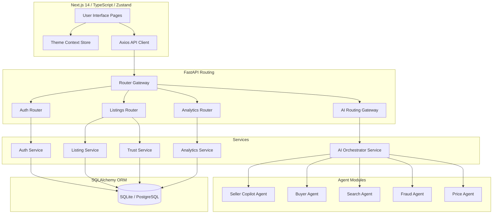
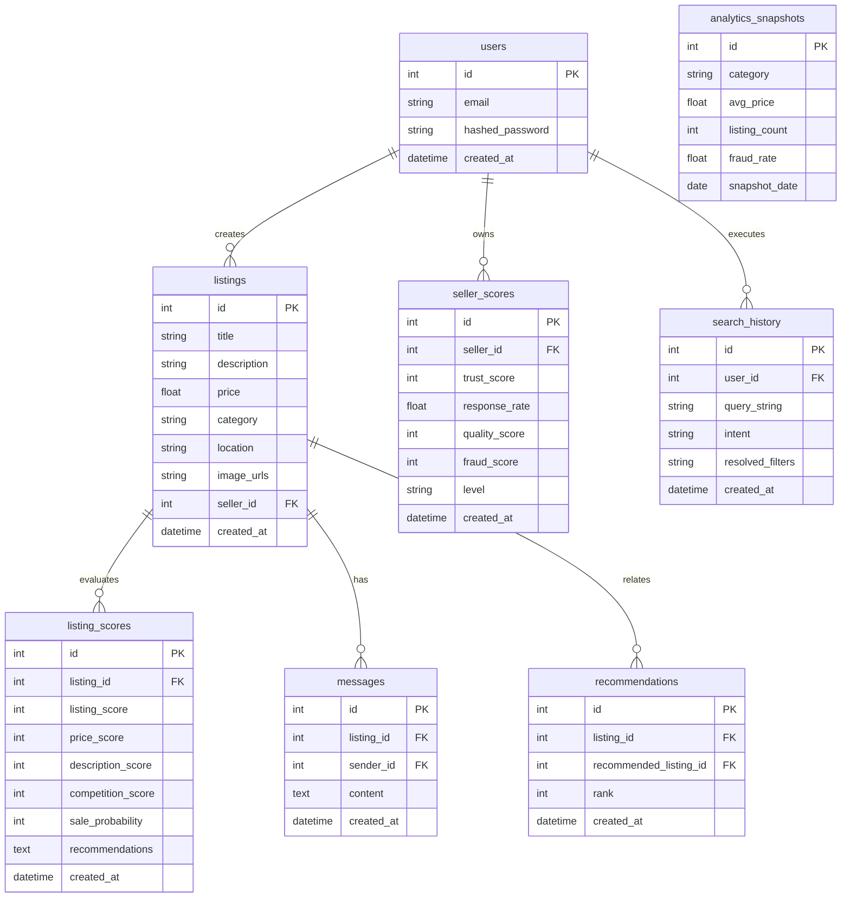

# Architecture Specification V3: SmartBazaar AI Marketplace Intelligence

This document outlines the system architecture, database design, API layouts, agent contracts, security guidelines, and deployment topologies for **SmartBazaar AI V3**.

---

## 1. High-Level Architecture

The platform follows a layered monolithic architecture. The design keeps deployment simple (single-developer, local Docker containers) while decoupling services cleanly into logical subsystems.



---

## 2. Database ER Diagram

To support Marketplace Intelligence V3, we add: `listing_scores`, `seller_scores`, `analytics_snapshots`, `recommendations`, and `search_history`.



---

## 3. API Architecture

### Authentication & Profiles
- **`POST /api/auth/register`**: Register new profiles.
- **`POST /api/auth/login`**: URL-encoded standard OAuth2 password forms.
- **`GET /api/auth/me`**: Fetches active session profile.

### Listings & Recommendations
- **`POST /api/listings`**: Add listing and triggers background safety/copilot calculations.
- **`GET /api/listings`**: Paginated main feed.
- **`GET /api/listings/{id}`**: Returns details, safety flags, and trust scores.
- **`GET /api/recommendations/{listing_id}`**: Retrieves similar products and trending listings.

### AI & Agent Services
- **`POST /api/ai/copilot`**: Analyzes listings before submission.
  - *Payload*: `{"title": str, "description": str, "price": float, "category": str, "condition": str}`
  - *Response*: `{"listing_score": int, "sale_probability": int, "competition_score": int, "improvements": list[str]}`
- **`POST /api/ai/buyer-agent`**: Evaluates value and safety.
  - *Payload*: `{"listing_id": int}`
  - *Response*: `{"recommendation": str, "confidence": int, "explanation": str, "pros": list[str], "cons": list[str], "fair_price": float, "risk_level": str}`
- **`POST /api/ai/search-agent`**: Resolves free-text semantic queries.
  - *Payload*: `{"query": str}`
  - *Response*: `{"intent": str, "category": str, "price_min": float, "price_max": float, "location": str, "keywords": list[str]}`

### Marketplace Analytics
- **`GET /api/analytics/overview`**: Natural-language AI summary and general counts.
- **`GET /api/analytics/trends`**: Price and fraud trends charts metadata.
- **`GET /api/analytics/categories`**: Category distributions and average velocities.
- **`GET /api/seller/trust-score/{seller_id}`**: Dynamic reputation statistics.

---

## 4. Agent Architecture

Workflows map to specialized Agent contexts executing decoupled operations:

| Agent Name | Inputs | Outputs | Core Responsibilities |
|---|---|---|---|
| **Seller Copilot** | Title, price, category, description | Quality score, velocity adjustments | Scores listings, recommends updates. |
| **Buyer Agent** | Listing ID, User ID | Pros/Cons list, BUY/AVOID advisory | Computes deal fairness, details safety. |
| **Search Agent** | Text query string | Resolved filter schema (category, price limits) | Extracts parameters, executes database indexes. |
| **Marketplace Intel** | Listing inventory log | Snapshots averages, trend indicators | Runs background category analysis. |
| **Fraud Agent** | Title, description text | Risk score, flagged phrases | Scans listings for scam patterns. |
| **Price Agent** | Title, category, condition | Suggested pricing bounds | Compares items with average valuations. |

---

## 5. Theme Architecture

Themes are handled globally using standard React Context and Zustand persistence stores.

```typescript
// Zustand Theme Store Interface
interface ThemeState {
  theme: 'light' | 'dark' | 'system';
  setTheme: (theme: 'light' | 'dark' | 'system') => void;
}
```

- **Persistence**: Zustand's standard `persist` middleware maps the chosen mode to `localStorage`.
- **System Sync**: A listener tracks system preference alterations (`window.matchMedia('(prefers-color-scheme: dark)')`) and switches colors on the fly if `"system"` is active.
- **Flicker Mitigation**: Root layouts inject a small synchronous runtime inline script reading theme values from storage before paint to avoid HTML background layout shifts.

---

## 6. Security Architecture

1. **Input Verification**: Enforced at the boundary by FastAPI's Pydantic schema validation.
2. **Rate Limiting**: Custom middleware tracks client IPs on endpoints `/api/auth/*` and `/api/ai/*` using local token bucket counters to block service crashes from brute-forcing.
3. **Prompt Sanitization**: Prompt constructors use static system definitions. Input values (e.g. titles/descriptions) are sanitized to replace command tokens (like `Ignore instructions`, `System prompt`), mitigating injection bugs.
4. **Data Isolation**: User password hashes are cryptographically protected via standard `bcrypt` hashing rules and are excluded from all outgoing response models.

---

## 7. Folder Structure V3

```text
E:\PPT\jio internship\cart/
├── backend/
│   ├── app/
│   │   ├── main.py              # Configures CORS, rate limiters, router groups
│   │   ├── database.py          # Session engines
│   │   ├── models/              # DB schemas (users, listings, scores, snapshots)
│   │   ├── routers/             # API Router endpoints
│   │   ├── services/            # Backend Service implementations
│   │   └── utils/               # JWT, Validation, Prompt sanitizers
├── frontend/
│   ├── src/
│   │   ├── app/
│   │   │   ├── analytics/       # Analytics dashboard pages
│   │   │   ├── create-listing/  # Form with AI Copilot panels
│   │   │   └── listing/[id]/    # Buyer advisor, Trust panels
│   │   ├── components/          # UI assets (AIBadge, ThemeToggle, Charts)
│   │   └── lib/                 # Zustand store, Axios clients
```

---

## 8. Architecture Decision Records (ADR)

### ADR-001: Next.js Output Standalone Mode
- **Status**: Accepted
- **Context**: The frontend container crashed because the project lacks a `public` directory. Large image builds slow compilation.
- **Decision**: Configure Next.js `output: 'standalone'` builds. 
- **Consequences**: Standardizes multi-stage builds. Cuts out redundant `node_modules` and skips copying non-existent `public` directories.

### ADR-002: Dynamic Database Snapshot compilation
- **Status**: Accepted
- **Context**: Executing live, heavy database counts and price deviations on every single listing fetch creates performance bottlenecks.
- **Decision**: Implement an asynchronous snapshot compiler service (`analytics_service.py`) that compiles counts and averages daily, caching values in the `analytics_snapshots` table.
- **Consequences**: Standardizes query times. Real-time listing queries deviate against the static cache, preserving SQLite/PostgreSQL read latencies (<250ms).

### ADR-003: Hybrid AI fallback architecture
- **Status**: Accepted
- **Context**: Paid cloud API credentials (OpenAI keys) might be missing during local development and testing.
- **Decision**: Build a strict local rule-based fallback inside the service interface layers. If `OPENAI_API_KEY` is not present, services automatically fallback to local keyword matching, scoring indexes, and string-matching regex lists.
- **Consequences**: Application operates offline without cloud dependencies.
