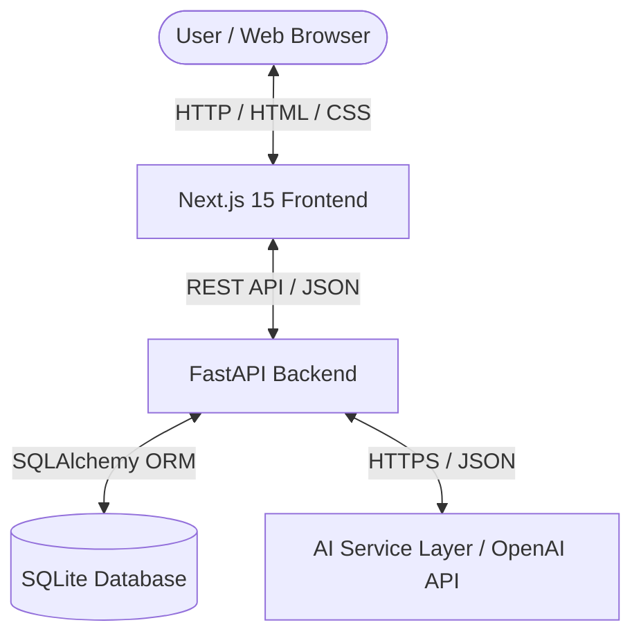
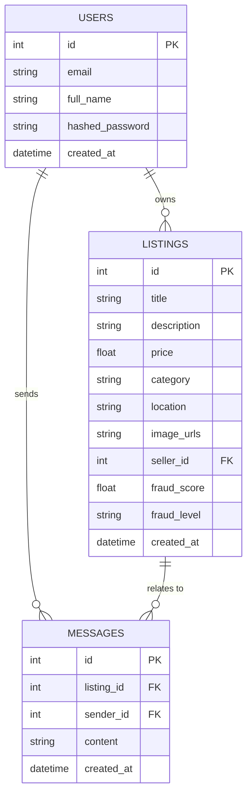
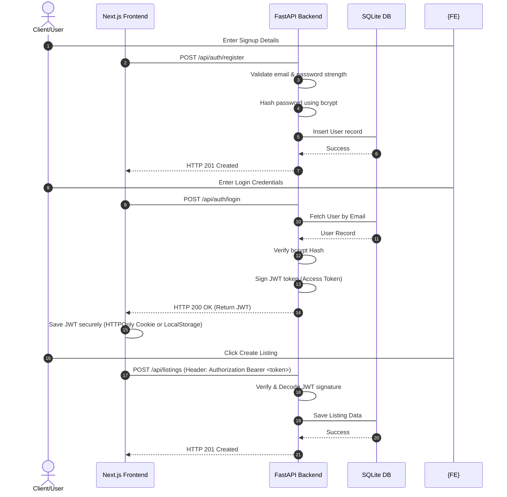

# SmartBazaar AI — Architecture Design

> This document outlines the technical architecture, design patterns, and deployment configurations for the SmartBazaar AI local P2P marketplace.

---

## 1. Executive Summary

SmartBazaar AI is built as a lightweight, robust, and highly responsive web application designed for local peer-to-peer item trading. It integrates AI components to assist sellers in creating high-quality listings and protect buyers from fraudulent postings. 

The application utilizes a **monolithic architecture** consisting of a React-based Next.js 15 frontend and a FastAPI backend written in Python. Data persistence is managed via an SQLite database using SQLAlchemy ORM. The AI integration uses a service layer that connects to the OpenAI API (using `gpt-4o-mini`) with a robust, rule-based local fallback engine to guarantee 100% system availability, even when API keys are absent or services are down.

---

## 2. Architecture Principles

Our design decisions are aligned directly with the project's development constitution:

- **Security First**: Input validation occurs at both the API boundary (via Pydantic schemas) and the client boundary (via React form validation). Direct database interactions are restricted to SQLAlchemy ORM parameterization to eliminate SQL injection risks. Authentication is handled using secure, signed JSON Web Tokens (JWT).
- **AI Transparency**: Users are clearly notified of AI-generated content (descriptions, pricing, and category predictions) using a distinctive UI badge. AI inputs are treated as recommendations, allowing the user to modify them before committing changes to the database.
- **Privacy**: Personal user contact data (email addresses, phone numbers) is never exposed in listing payloads. All seller-buyer communication occurs in-app via a localized messaging system.
- **Simplicity**: We choose a monolithic structure and an SQLite database to maintain velocity, reduce deployment complexity, and ensure a single developer can easily maintain the application during the 1-week timeline.
- **Working Software First**: The system implements simple, robust fallbacks for all AI services first. This guarantees that the core P2P features (authentication, listings, search, and chat) remain functional under all network conditions.

---

## 3. System Context Diagram

The system context diagram below highlights the flow of communication between components.



---

## 4. Component Architecture

### Frontend Components (Next.js)
- **Navbar**: Main navigation component that displays branding, search triggers, user authentication state (Login/Register or User Dashboard), and listing creation actions.
- **ListingCard**: Renders a summary of a listing (title, first image, price, location, tags, and category) with subtle CSS micro-animations on hover.
- **SearchBar**: Global search control supporting text queries, category filters, and location options.
- **ChatBox**: Embedded message panel on the listing detail page, handling messaging between buyer and seller.
- **AIRecommendationPanel**: Sidebar overlay that suggests optimized listing descriptions, predicted categories, and recommended price ranges to sellers during listing creation.

### Backend Modules (FastAPI)
- **auth**: Handles user registration, credentials verification, password hashing, and token issuing.
- **users**: Handles profile queries, user-owned listing fetching, and preferences.
- **listings**: Orchestrates full CRUD logic for listings and image storage handling.
- **search**: Exposes high-performance queries for filtering listings by text, category, and location.
- **chat**: Handles message storage, conversation retrieval, and mock auto-reply job queuing.
- **ai**: The API endpoints that interact with the local AI Service layer for generating description metadata and checking listing risk.

---

## 5. Database Architecture

The persistence model relies on an SQLite database. Relationships are illustrated in the ER diagram below.



### Table Schemas

#### users
- `id` (INTEGER, Primary Key): Unique user identifier.
- `email` (VARCHAR, Unique, Indexed): User's registration email.
- `full_name` (VARCHAR): User's display name.
- `hashed_password` (VARCHAR): Secure bcrypt password hash.
- `created_at` (DATETIME): Timestamp of registration.

#### listings
- `id` (INTEGER, Primary Key): Unique listing identifier.
- `title` (VARCHAR, Indexed): Short product title.
- `description` (TEXT): Comprehensive item description.
- `price` (FLOAT): Price of the item in INR (₹).
- `category` (VARCHAR): Product category classification.
- `location` (VARCHAR): Item's physical trading location.
- `image_urls` (TEXT): Stringified JSON array containing image URLs (up to 4).
- `seller_id` (INTEGER, Foreign Key to `users.id`): Owner of the listing.
- `fraud_score` (FLOAT): Computed AI listing risk score (0 to 100).
- `fraud_level` (VARCHAR): Risk classification (`Low`, `Medium`, `High`).
- `created_at` (DATETIME): Timestamp of creation.

#### messages
- `id` (INTEGER, Primary Key): Unique message identifier.
- `listing_id` (INTEGER, Foreign Key to `listings.id`): Listing context of the chat.
- `sender_id` (INTEGER, Foreign Key to `users.id`): Message author.
- `content` (TEXT): Text content of the message.
- `created_at` (DATETIME): Timestamp of when the message was sent.

*Note on Chat Routing*: Since messages are linked to a specific listing, the recipient of a message is deduced dynamically: if the message sender is the seller, the recipient is the buyer who initiated the thread; otherwise, the recipient is the seller.

---

## 6. Authentication Architecture

SmartBazaar AI uses stateless JSON Web Token (JWT) authentication. The authentication flow is shown below.



---

## 7. AI Service Architecture

The AI Service Layer coordinates API requests to OpenAI and switches to a rule-based fallback when keys are missing.

```text
               +-----------------------------+
               |      FastAPI Router         |
               +--------------+--------------+
                              |
                              v
               +--------------+--------------+
               |      AI Service Orchestration|
               +--------------+--------------+
                              |
              +---------------+---------------+
              |                               |
       [OpenAI Key Available?]       [OpenAI Key Missing?]
              |                               |
              v                               v
    +---------+---------+           +---------+---------+
    |   OpenAI Client   |           |  Local Fallback   |
    |  (gpt-4o-mini)    |           |  Rule-Based Engine|
    +-------------------+           +-------------------+
```

### AI Features and Fallbacks

1. **AI Description Generator**:
   - *Active state*: Uses a prompt template targeting `gpt-4o-mini` to construct a 2–3 sentence professional description using provided product keywords.
   - *Fallback state*: Returns a pre-templated product description using string interpolation based on title, condition, and category.
2. **AI Category Predictor**:
   - *Active state*: Prompts the model to return exactly one category from the predefined set (Electronics, Furniture, Fashion, Books, Vehicles, Others) matching the title.
   - *Fallback state*: Scans the title against regex keyword mappings (e.g., "iphone" -> "Electronics", "table" -> "Furniture").
3. **AI Price Recommendation**:
   - *Active state*: Requests standard market pricing bounds based on item title and condition.
   - *Fallback state*: Computes price suggestions using static baseline category multipliers.
4. **AI Fraud Detection**:
   - *Active state*: Prompts the AI model to analyze description text for scam indicators, returning a risk score (0-100), risk level, and reasons.
   - *Fallback state*: Runs a local substring search for known scam phrases (e.g., "Western Union", "deposit first", "100% safe guaranteed") and assigns scores programmatically (e.g., +30 per phrase matched).

---

## 8. API Architecture

All endpoints reside under the `/api` prefix. The backend returns standard JSON payloads.

| Category | Method | Endpoint | Auth Required | Description |
| :--- | :--- | :--- | :--- | :--- |
| **Auth** | `POST` | `/api/auth/register` | No | Creates a new user account. |
| **Auth** | `POST` | `/api/auth/login` | No | Authenticates credentials, returns JWT. |
| **Auth** | `GET` | `/api/auth/me` | Yes | Retrieves current user profile. |
| **Listings** | `POST` | `/api/listings` | Yes | Creates a new listing. |
| **Listings** | `GET` | `/api/listings` | No | Fetches a paginated list of all active items. |
| **Listings** | `GET` | `/api/listings/{id}` | No | Fetches details for a specific listing. |
| **Listings** | `PUT` | `/api/listings/{id}` | Yes | Modifies a listing (Owner only). |
| **Listings** | `DELETE` | `/api/listings/{id}` | Yes | Deletes a listing (Owner only). |
| **Search** | `GET` | `/api/search` | No | Search listings by text, category, and location. |
| **Chat** | `POST` | `/api/chat/messages` | Yes | Sends a chat message. Triggers seller mock reply. |
| **Chat** | `GET` | `/api/chat/conversations/{id}`| Yes | Fetches message thread for a listing. |
| **AI** | `POST` | `/api/ai/describe` | Yes | Generates optimized descriptions from keywords. |
| **AI** | `POST` | `/api/ai/predict-category` | Yes | Predicts listing category from title. |
| **AI** | `POST` | `/api/ai/recommend-price` | Yes | Recommends pricing based on title & condition. |

---

## 9. Security Architecture

- **Input Validation**: Handled by FastAPI's Pydantic validation engine. Unreasonable prices, empty strings, and malformed emails are blocked at the boundary.
- **Password Hashing**: Implemented using `passlib` with `bcrypt`. Passwords are encrypted before database insert.
- **JWT**: JWT signatures use a 256-bit secret key (`JWT_SECRET`) loaded from environmental files. Tokens carry an expiration time (default: 24 hours).
- **CORS**: FastAPI CORS middleware restricts API consumption strictly to authorized origin headers (e.g., `http://localhost:3000`).
- **XSS Prevention**: Next.js automatically escapes values rendered in JSX. HTML input forms exclude raw parsing, preventing HTML injection.
- **SQL Injection Prevention**: SQLAlchemy parameterized queries separate executable query commands from text input variables.
- **File Upload Validation**: Listings image uploads must be validated for mime-type (allowing only JPG, PNG, WEBP) and maximum size limits (5MB per file).

---

## 10. Deployment Architecture

The application is deployed locally via Docker Compose.

- **Frontend Container**: Next.js service running on port `3000`.
- **Backend Container**: FastAPI/Uvicorn server running on port `8000`.
- **SQLite Persistence**: The database file (`db.sqlite3`) and uploaded images directory are mounted inside the Docker host using persistent directories to prevent data loss when containers restart.

```yaml
version: '3.8'
services:
  backend:
    build: ./backend
    ports:
      - "8000:8000"
    volumes:
      - sqlite_data:/app/data
      - uploads_data:/app/uploads
    environment:
      - DATABASE_URL=sqlite:///./data/db.sqlite3
      - OPENAI_API_KEY=${OPENAI_API_KEY}
      - JWT_SECRET=${JWT_SECRET}

  frontend:
    build: ./frontend
    ports:
      - "3000:3000"
    environment:
      - NEXT_PUBLIC_API_URL=http://localhost:8000
```

---

## 11. Scalability & Evolution Path

1. **Database Upgrade**: Standard SQLAlchemy initialization allows switching from SQLite to PostgreSQL by updating the `DATABASE_URL` environment string.
2. **WebSocket Chat**: The dummy local chat can be replaced with real-time communications by adding WebSockets routers in FastAPI (`APIRouter.websocket`) and connection managers.
3. **AI Microservice**: AI analysis and classification can be offloaded to an asynchronous message broker queue (e.g., Celery + Redis) to handle bulk listing updates.

---

## 12. Risks and Mitigations

| Risk | Mitigation |
| :--- | :--- |
| **OpenAI Service Downtime** | Fallback to the local regex and template rule engine immediately when OpenAI raises connection exceptions. |
| **AI Hallucinations** | Render all AI output as editable recommendations, allowing the user to review and correct predictions. |
| **Invalid/Malicious Uploads** | Run server-side validations on file size, magic numbers, and image extensions. |
| **Authentication Failures** | Ensure detailed logging for JWT failures and secure exception responses (401/403) returned to users. |

---

## 13. Architecture Decision Records (ADR)

### ADR-001: Use SQLite for MVP
- **Context**: The MVP requires rapid local development and zero configuration overhead.
- **Decision**: Use SQLite as the database engine.
- **Consequence**: Enables single-file database persistence without requiring a separate database container run during development, easily swappable with PostgreSQL later.

### ADR-002: Monolithic FastAPI Backend
- **Context**: Code must be developed by a single user within 1 week.
- **Decision**: Keep the backend in a single monolithic service.
- **Consequence**: Speeds up compilation, avoids microservice serialization overhead, and keeps routing clean.

### ADR-003: Rule-Based Fallback for AI Services
- **Context**: The user may not supply a paid OpenAI API key, and network failures must not break core operations.
- **Decision**: Integrate a rule-based fallback framework in the AI Service.
- **Consequence**: Guaranteed offline operation, zero cost baseline, and resilient mock responses.

### ADR-004: JWT Session-less Authentication
- **Context**: Secure access controls for listings operations.
- **Decision**: Use stateless JWT access tokens in requests.
- **Consequence**: Decouples session lookups from the database, improving API performance and scalability.
