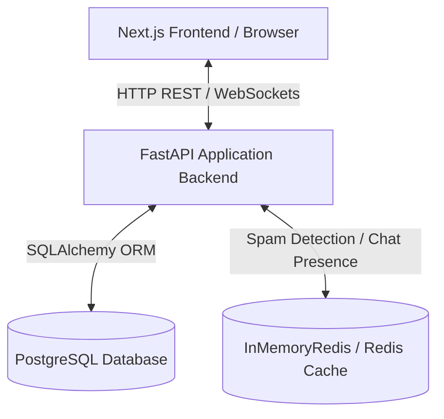

# System Architecture: SmartBazaar V2

This document details the software architecture, system flow, component design, and integration pathways of the SmartBazaar AI-enhanced marketplace platform.

---

## 1. Overview & Tier Structure

SmartBazaar is a multi-tier, AI-copilot enabled marketplace platform built with a high-performance Python FastAPI backend, a responsive React/Next.js frontend, and a PostgreSQL database.

- **Frontend Tier**: Single Page Application built with Next.js (TypeScript, Tailwind CSS). Connects to API endpoints and WebSocket channels.
- **Backend Tier**: FastAPI Python framework orchestrating services, schema validation (Pydantic), background queues, and routing modules.
- **Data Tier**: Relational PostgreSQL database for structured data storage, and Redis/InMemoryRedis cache for chat presence, rate-limiting, and spam detection fallback.

---

## 2. Component Design & Service Layers

The backend codebase is structured into cohesive service layers to isolate concerns and ease maintainability:

1. **Routers Layer (`backend/app/routers/`)**: Handles incoming HTTP requests, maps JSON bodies using Pydantic schemas, and manages authorization policies.
2. **Services Layer (`backend/app/services/`)**: Implements primary business logic (Offers, Trust Recalculations, CRM activities, Verification processing).
3. **AI Copilot & Agents (`backend/app/services/ai_service.py`, `marketplace_search_agent.py`, `comparison_agent.py`)**: Parses natural language inputs, identifies intent, queries listings, compares options, and builds structured response models.
4. **Database Models (`backend/app/models/`)**: Declares SQLAlchemy model structures, database table schemas, keys, constraints, and relationships.

---

## 3. Core Pipelines

### A. Intelligent Intent & Search Pipeline
When a user interacts with the AI Copilot:
1. The **AI Service Parser** matches natural language against defined search/compare/advice intents.
2. The **Marketplace Search Agent** performs structured filtering by extracting budget, category, location, and seller trust constraints.
3. The **Precalculated Trust Fetcher** dynamically retrieves seller ratings to filter out high-risk listings or feature high-trust listings.

### B. Trust Score & Verification Recalculation Loop
To prevent N+1 query locks and optimize response times, the trust loop operates on a cached precalculation schedule:
- **Seller scores** are updated asynchronously in the background via the `JobService` queue handler.
- **Buyer scores** are computed via `TrustScoreService` considering account lifetime, verified transactions, and reports.
- Reads are directed to the `seller_scores` table directly rather than recalculating scores on every query.

---

## 4. Communication Protocols

- **RESTful HTTP**: Used for configuration settings, authentication, profile lookups, CRM data tables, listings management, and document uploads.
- **WebSockets**: Established for the real-time chat service to synchronize instant messaging notifications, typing indications, and user online presence.
