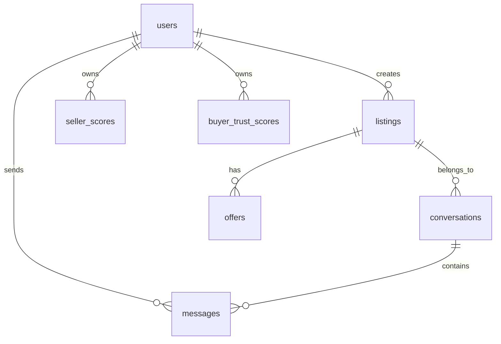

# Database Design: SmartBazaar V2

This document describes the relational database structure, model entities, constraint integrity, and index configurations of the SmartBazaar platform.

---

## 1. Schema Diagram & Relationships

The database is built on SQLAlchemy models and managed through Alembic migrations.

### Table Reference Map

1. **`users`**: Contains user profile data, credentials (hashed), administrative boolean flags (`is_admin`), and created date.
2. **`listings`**: Holds items posted for sale, linked to `users.id` as `seller_id`. Includes price, location, categories, fraud metrics, and status flags.
3. **`conversations`**: Acts as a bridge connecting a specific listing, buyer, and seller. Has a composite unique constraint `uq_listing_buyer_conversation` on `(listing_id, buyer_id)` to enforce chat uniqueness.
4. **`messages`**: Contains individual text messages sent within conversations.
5. **`offers`**: Manages negotiation offers between buyer and seller regarding listings.
6. **`seller_scores` / `buyer_scores`**: Holds precalculated metrics to prevent N+1 computation load during listings browsing and search.

---

## 2. Integrity & Database Constraints

- **Composite Unique Constraint**: A composite constraint `uq_listing_buyer_conversation` on the `conversations` table ensures that only a single chat thread can exist between a buyer and a seller for any given listing.
- **Foreign Keys**: Cascading deletes are enforced on listings so that deleting a listing automatically cleans up all associated messages, offers, and conversation records:
  - `ForeignKey("users.id", ondelete="CASCADE")`
  - `ForeignKey("listings.id", ondelete="CASCADE")`
  - `ForeignKey("conversations.id", ondelete="CASCADE")`

---

## 3. Indexing Strategy

To speed up query filtering and ordering in the search agent and main routes, key columns have indexes applied:
- **Search Filters**: `listings.title`, `listings.category`, and `listings.location` are indexed to enable low-latency searches.
- **Relational Lookups**: Indexing is applied on foreign keys (`seller_id`, `buyer_id`, `listing_id`) to accelerate `JOIN` queries.
- **Precalculated Tables**: `seller_scores.seller_id` is indexed to optimize trust score lookups.
