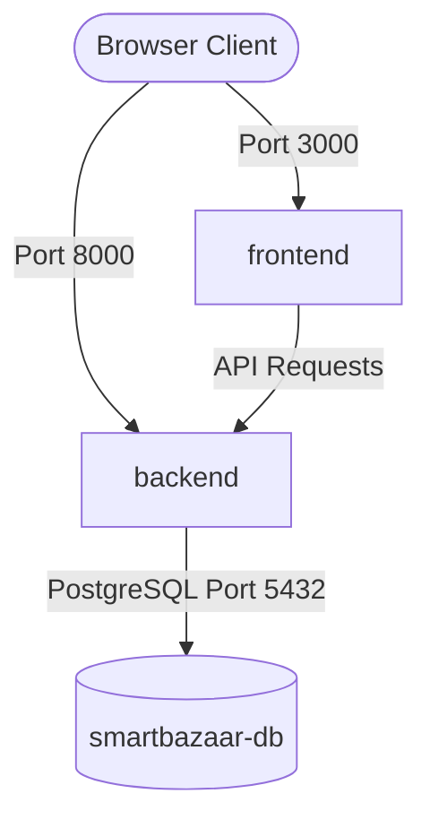

# Docker Review Report: SmartBazaar AI

This report reviews the orchestration configurations, Docker images, and multi-stage container builds of the **SmartBazaar AI** project.

---

## 1. Containerization Overview

The project is containerized for standard Docker environments. A single command (`docker compose up --build`) launches the complete application stack locally:
- **db**: PostgreSQL database container.
- **backend**: FastAPI application server.
- **frontend**: Next.js 14 client interface.

---

## 2. Container Architectures

### 1. Database Service (`db`)
- **Image**: `postgres:15-alpine`
- **Volume Mounts**: `postgres_data` mapped to `/var/lib/postgresql/data` ensures user accounts, listings, and messages persist between container rebuilds.
- **Health Checks**: Uses standard Postgres readiness check `pg_isready -U postgres -d smartbazaar`. Check configuration updates every 5 seconds, preventing the backend from attempting connections while database services boot up.

### 2. Backend Service (`backend`)
- **Base Image**: `python:3.11-slim`
- **Build Caching**: Copies `requirements.txt` and runs `pip install` before copying source code. This isolates dependencies layers and accelerates local container rebuilds when python source code edits occur.
- **Environment Resolution**: Sets `PYTHONPATH=/workspace` and runs the web server out of `/workspace/backend` folder, ensuring imports like `backend.app.main:app` execute without module resolution faults.
- **Port Mapping**: Binds host port `8000` to container port `8000`.

### 3. Frontend Service (`frontend`)
- **Multi-Stage Build**: Employs a 3-stage Alpine build process to optimize production container sizes:
  - **Stage 1 (deps)**: Copies `package.json` and runs `npm install` to load build-time node packages.
  - **Stage 2 (builder)**: Imports dependencies from Stage 1, copies the frontend source code, sets the build-time environment parameter `NEXT_PUBLIC_API_URL`, and compiles the Next.js production bundle (`npm run build`).
  - **Stage 3 (runner)**: Standard lightweight runtime image containing only the built `.next`, `public`, `node_modules` folders, and `package.json`. The source code is excluded, reducing the production image footprint.
- **Port Mapping**: Binds host port `3000` to container port `3000`.

---

## 3. Configuration & Networking

### Port Configuration Matrix
- **`3000`**: Exposes Next.js frontend pages.
- **`8000`**: Exposes FastAPI backend endpoints and the OpenAPI Swagger documentation.
- **`5432`**: Exposes PostgreSQL database for local diagnostic querying (can be commented out in production environments to lock down db access).

### Networking Setup
- Docker Compose sets up an isolated virtual network allowing services to find each other by name (e.g. backend reaches the database via hostname `db` instead of hardcoding IP addresses).
- **Service Dependency Control**: The backend service uses `depends_on` with `condition: service_healthy` referencing the database health check. This ensures SQL tables registration and FastAPI initialization checks don't crash from timing mismatches on startup.
