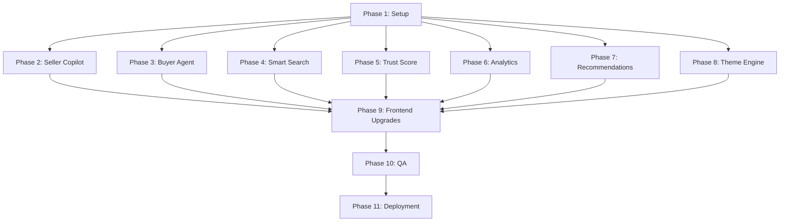

# Tasks: Marketplace Intelligence Platform

**Input**: Design documents from `/specs/002-marketplace-intelligence/`

**Prerequisites**: plan.md, spec.md, research.md, data-model.md, contracts/api.md

---

## Phase 1: Setup & Foundation

**Purpose**: Database schema upgrades and baseline V3 migrations.

- [ ] T051 Upgrade database schema to support V3 tables in backend/app/database.py
  - **Priority**: High
  - **Dependencies**: None
  - **Estimated Time**: 2h
  - **Agent**: Architect Agent
  - **Acceptance Criteria**: Database initialization script executes without schema errors; PostgreSQL and SQLite adapters support V3 tables.
  - **Status**: Todo
  - **Risk Level**: Low
- [ ] T052 Create listing_scores model in backend/app/models/listing_score.py
  - **Priority**: High
  - **Dependencies**: T051
  - **Estimated Time**: 1.5h
  - **Agent**: Backend Agent
  - **Acceptance Criteria**: `ListingScore` model created with columns: `id`, `listing_id`, `listing_score`, `price_score`, `description_score`, `competition_score`, `sale_probability`, `recommendations`, `created_at`.
  - **Status**: Todo
  - **Risk Level**: Low
- [ ] T053 Create seller_scores model in backend/app/models/seller_score.py
  - **Priority**: High
  - **Dependencies**: T051
  - **Estimated Time**: 1.5h
  - **Agent**: Backend Agent
  - **Acceptance Criteria**: `SellerScore` model created with columns: `id`, `seller_id`, `trust_score`, `response_rate`, `quality_score`, `fraud_score`, `level`, `created_at`.
  - **Status**: Todo
  - **Risk Level**: Low
- [ ] T054 Create analytics_snapshots model in backend/app/models/analytics_snapshot.py
  - **Priority**: Medium
  - **Dependencies**: T051
  - **Estimated Time**: 1.5h
  - **Agent**: Backend Agent
  - **Acceptance Criteria**: `AnalyticsSnapshot` model created with columns: `id`, `category`, `avg_price`, `listing_count`, `fraud_rate`, `snapshot_date`.
  - **Status**: Todo
  - **Risk Level**: Low
- [ ] T055 Create recommendations model in backend/app/models/recommendation.py
  - **Priority**: Medium
  - **Dependencies**: T051
  - **Estimated Time**: 1.5h
  - **Agent**: Backend Agent
  - **Acceptance Criteria**: `Recommendation` model created with columns: `id`, `listing_id`, `recommended_listing_id`, `rank`, `created_at`.
  - **Status**: Todo
  - **Risk Level**: Low
- [ ] T056 Create search_history model in backend/app/models/search_history.py
  - **Priority**: Low
  - **Dependencies**: T051
  - **Estimated Time**: 1.5h
  - **Agent**: Backend Agent
  - **Acceptance Criteria**: `SearchHistory` model created with columns: `id`, `user_id`, `query_string`, `intent`, `resolved_filters`, `created_at`.
  - **Status**: Todo
  - **Risk Level**: Low

---

## Phase 2: Seller Copilot (User Story 1)

**Goal**: Implement AI-assisted listing valuation, scoring, and analysis before submission.
**Independent Test**: Trigger a mock copilot analysis payload on listings, asserting correct score evaluations and suggestions list returns.

- [ ] T057 [US1] Create Seller Copilot Service in backend/app/services/ai_service.py
  - **Priority**: High
  - **Dependencies**: T052
  - **Estimated Time**: 3h
  - **Agent**: Seller Copilot Agent
  - **Acceptance Criteria**: `CopilotService` initialized with mock/fallback rules and OpenAI integration.
  - **Status**: Todo
  - **Risk Level**: Medium
- [ ] T058 [US1] Listing Quality Analyzer in backend/app/services/ai_service.py
  - **Priority**: High
  - **Dependencies**: T057
  - **Estimated Time**: 2h
  - **Agent**: Seller Copilot Agent
  - **Acceptance Criteria**: Evaluates description/title lengths and image counts, returning `listing_score`.
  - **Status**: Todo
  - **Risk Level**: Low
- [ ] T059 [US1] Price Quality Analyzer in backend/app/services/ai_service.py
  - **Priority**: High
  - **Dependencies**: T057
  - **Estimated Time**: 2h
  - **Agent**: Price Agent
  - **Acceptance Criteria**: Compares listings price against category averages to return a `price_score`.
  - **Status**: Todo
  - **Risk Level**: Medium
- [ ] T060 [US1] Competition Analyzer in backend/app/services/ai_service.py
  - **Priority**: Medium
  - **Dependencies**: T057
  - **Estimated Time**: 2h
  - **Agent**: Seller Copilot Agent
  - **Acceptance Criteria**: Scans category volume density to compute a `competition_score`.
  - **Status**: Todo
  - **Risk Level**: Low
- [ ] T061 [US1] Sale Probability Engine in backend/app/services/ai_service.py
  - **Priority**: High
  - **Dependencies**: T057
  - **Estimated Time**: 2.5h
  - **Agent**: Seller Copilot Agent
  - **Acceptance Criteria**: Calculates sale probability percentage from quality and pricing metrics.
  - **Status**: Todo
  - **Risk Level**: Medium
- [ ] T062 [US1] Improvement Suggestion Generator in backend/app/services/ai_service.py
  - **Priority**: High
  - **Dependencies**: T057
  - **Estimated Time**: 2h
  - **Agent**: Seller Copilot Agent
  - **Acceptance Criteria**: Returns list of actionable improvement strings based on failed criteria thresholds.
  - **Status**: Todo
  - **Risk Level**: Low
- [ ] T063 [US1] Seller Copilot API in backend/app/routers/ai.py
  - **Priority**: High
  - **Dependencies**: T058, T059, T060, T061, T062
  - **Estimated Time**: 2h
  - **Agent**: Backend Agent
  - **Acceptance Criteria**: Exposes `POST /api/ai/copilot` returning score and recommendations JSON.
  - **Status**: Todo
  - **Risk Level**: Low
- [ ] T064 [US1] Seller Copilot Tests in tests/test_copilot.py
  - **Priority**: High
  - **Dependencies**: T063
  - **Estimated Time**: 2h
  - **Agent**: QA Agent
  - **Acceptance Criteria**: Pytest suite runs and passes checks for high/low scores and fallback modes.
  - **Status**: Todo
  - **Risk Level**: Low

---

## Phase 3: Buyer Agent (User Story 2)

**Goal**: Implement "Should I Buy This?" analysis showing pros/cons and deal ratings.
**Independent Test**: Navigate to item page, trigger Buy Advisor, verify advice BUY/NEGOTIATE/AVOID matches risk levels.

- [ ] T065 [US2] Buyer Agent Service in backend/app/services/ai_service.py
  - **Priority**: High
  - **Dependencies**: T053
  - **Estimated Time**: 3h
  - **Agent**: Buyer Agent
  - **Acceptance Criteria**: Initializes buyer advisor orchestration using mock and OpenAI client scripts.
  - **Status**: Todo
  - **Risk Level**: Medium
- [ ] T066 [US2] Fair Price Analyzer in backend/app/services/ai_service.py
  - **Priority**: High
  - **Dependencies**: T065
  - **Estimated Time**: 2h
  - **Agent**: Price Agent
  - **Acceptance Criteria**: Compares item price to market average and sets deal evaluations (good deal, overpriced).
  - **Status**: Todo
  - **Risk Level**: Medium
- [ ] T067 [US2] Risk Analyzer in backend/app/services/ai_service.py
  - **Priority**: High
  - **Dependencies**: T065
  - **Estimated Time**: 2h
  - **Agent**: Fraud Agent
  - **Acceptance Criteria**: Resolves listing security risk level based on seller trust history and text scans.
  - **Status**: Todo
  - **Risk Level**: Medium
- [ ] T068 [US2] Pros Cons Generator in backend/app/services/ai_service.py
  - **Priority**: High
  - **Dependencies**: T065
  - **Estimated Time**: 2h
  - **Agent**: Buyer Agent
  - **Acceptance Criteria**: Returns an array of dynamic pros and cons based on listing score metrics.
  - **Status**: Todo
  - **Risk Level**: Low
- [ ] T069 [US2] BUY NEGOTIATE AVOID Engine in backend/app/services/ai_service.py
  - **Priority**: High
  - **Dependencies**: T065
  - **Estimated Time**: 1.5h
  - **Agent**: Buyer Agent
  - **Acceptance Criteria**: Evaluates parameters and maps the final recommendation category.
  - **Status**: Todo
  - **Risk Level**: Low
- [ ] T070 [US2] Buyer Agent API in backend/app/routers/ai.py
  - **Priority**: High
  - **Dependencies**: T066, T067, T068, T069
  - **Estimated Time**: 2h
  - **Agent**: Backend Agent
  - **Acceptance Criteria**: Exposes `POST /api/ai/buyer-agent` returning explainability payload.
  - **Status**: Todo
  - **Risk Level**: Low
- [ ] T071 [US2] Buyer Agent Tests in tests/test_buyer_agent.py
  - **Priority**: High
  - **Dependencies**: T070
  - **Estimated Time**: 2h
  - **Agent**: QA Agent
  - **Acceptance Criteria**: Asserts correct advice output for scammed listings (AVOID) and good deals (BUY).
  - **Status**: Todo
  - **Risk Level**: Low

---

## Phase 4: Smart Search (User Story 3)

**Goal**: Implement semantic search query parsing to resolve natural language terms.
**Independent Test**: Search for "budget laptop under 25000 in Mumbai", verify resolved filters array query.

- [ ] T072 [US3] Natural Language Search Service in backend/app/services/ai_service.py
  - **Priority**: High
  - **Dependencies**: T056
  - **Estimated Time**: 3h
  - **Agent**: Search Agent
  - **Acceptance Criteria**: Parses free-text strings and returns a structured parameters dictionary.
  - **Status**: Todo
  - **Risk Level**: Medium
- [ ] T073 [US3] Intent Parser in backend/app/services/ai_service.py
  - **Priority**: High
  - **Dependencies**: T072
  - **Estimated Time**: 2h
  - **Agent**: Search Agent
  - **Acceptance Criteria**: Classifies search intent (e.g. `buy_electronics`, `search_furniture`).
  - **Status**: Todo
  - **Risk Level**: Low
- [ ] T074 [US3] Keyword Extractor in backend/app/services/ai_service.py
  - **Priority**: High
  - **Dependencies**: T072
  - **Estimated Time**: 2h
  - **Agent**: Search Agent
  - **Acceptance Criteria**: Cleans query string to compile keyword search indices.
  - **Status**: Todo
  - **Risk Level**: Low
- [ ] T075 [US3] Price Range Extractor in backend/app/services/ai_service.py
  - **Priority**: High
  - **Dependencies**: T072
  - **Estimated Time**: 2h
  - **Agent**: Search Agent
  - **Acceptance Criteria**: Resolves numeric bounds (e.g. "under 5000", "between 2000 and 6000").
  - **Status**: Todo
  - **Risk Level**: Low
- [ ] T076 [US3] Location Extractor in backend/app/services/ai_service.py
  - **Priority**: Medium
  - **Dependencies**: T072
  - **Estimated Time**: 1.5h
  - **Agent**: Search Agent
  - **Acceptance Criteria**: Maps geographic terms (e.g., "in Pune") to the query parameters object.
  - **Status**: Todo
  - **Risk Level**: Low
- [ ] T077 [US3] Search Agent API in backend/app/routers/search.py
  - **Priority**: High
  - **Dependencies**: T073, T074, T075, T076
  - **Estimated Time**: 2h
  - **Agent**: Backend Agent
  - **Acceptance Criteria**: Integrates smart parsing with the database query builder on `/api/search`.
  - **Status**: Todo
  - **Risk Level**: Medium
- [ ] T078 [US3] Search Agent Tests in tests/test_smart_search.py
  - **Priority**: High
  - **Dependencies**: T077
  - **Estimated Time**: 2h
  - **Agent**: QA Agent
  - **Acceptance Criteria**: Asserts that query filters extract correct boundaries for tests inputs.
  - **Status**: Todo
  - **Risk Level**: Low

---

## Phase 5: Trust Score Engine (User Story 6)

**Goal**: Dynamic seller profile reputation scores compilation.

- [ ] T079 [US6] Trust Score Service in backend/app/services/trust_service.py
  - **Priority**: High
  - **Dependencies**: T053
  - **Estimated Time**: 2.5h
  - **Agent**: Marketplace Intelligence Agent
  - **Acceptance Criteria**: Computes seller reputation score out of 100 points dynamically.
  - **Status**: Todo
  - **Risk Level**: Low
- [ ] T080 [US6] Seller Reputation Calculator in backend/app/services/trust_service.py
  - **Priority**: High
  - **Dependencies**: T079
  - **Estimated Time**: 2h
  - **Agent**: Marketplace Intelligence Agent
  - **Acceptance Criteria**: Scores user profile completion and average listing quality scores.
  - **Status**: Todo
  - **Risk Level**: Low
- [ ] T081 [US6] Fraud Weighting Logic in backend/app/services/trust_service.py
  - **Priority**: High
  - **Dependencies**: T079
  - **Estimated Time**: 1.5h
  - **Agent**: Fraud Agent
  - **Acceptance Criteria**: Subtracts trust score weight if the user has listings flagged as scammed.
  - **Status**: Todo
  - **Risk Level**: Low
- [ ] T082 [US6] Response Rate Calculator in backend/app/services/trust_service.py
  - **Priority**: Medium
  - **Dependencies**: T079
  - **Estimated Time**: 2h
  - **Agent**: Marketplace Intelligence Agent
  - **Acceptance Criteria**: Analyzes user message timestamps to compile average reply frequency rates.
  - **Status**: Todo
  - **Risk Level**: Low
- [ ] T083 [US6] Trust Score API in backend/app/routers/auth.py
  - **Priority**: High
  - **Dependencies**: T080, T081, T082
  - **Estimated Time**: 2h
  - **Agent**: Backend Agent
  - **Acceptance Criteria**: Exposes `/api/seller/trust-score/{seller_id}` endpoint.
  - **Status**: Todo
  - **Risk Level**: Low
- [ ] T084 [US6] Trust Score Tests in tests/test_trust.py
  - **Priority**: High
  - **Dependencies**: T083
  - **Estimated Time**: 2h
  - **Agent**: QA Agent
  - **Acceptance Criteria**: Asserts that profile verification tier assigns trust level properly (Trusted/Verified/New).
  - **Status**: Todo
  - **Risk Level**: Low

---

## Phase 6: Marketplace Intelligence (User Story 4)

**Goal**: Aggregate analytics and print natural language summaries.

- [ ] T085 [US4] Analytics Service in backend/app/services/analytics_service.py
  - **Priority**: Medium
  - **Dependencies**: T054
  - **Estimated Time**: 3h
  - **Agent**: Marketplace Intelligence Agent
  - **Acceptance Criteria**: Compiles daily database average price and counts snapshots caches.
  - **Status**: Todo
  - **Risk Level**: Medium
- [ ] T086 [US4] Category Analytics in backend/app/services/analytics_service.py
  - **Priority**: Medium
  - **Dependencies**: T085
  - **Estimated Time**: 2h
  - **Agent**: Marketplace Intelligence Agent
  - **Acceptance Criteria**: Aggregates item counts and listings frequency grouped by category.
  - **Status**: Todo
  - **Risk Level**: Low
- [ ] T087 [US4] Price Analytics in backend/app/services/analytics_service.py
  - **Priority**: Medium
  - **Dependencies**: T085
  - **Estimated Time**: 1.5h
  - **Agent**: Price Agent
  - **Acceptance Criteria**: Compiles average categories valuations.
  - **Status**: Todo
  - **Risk Level**: Low
- [ ] T088 [US4] Fraud Analytics in backend/app/services/analytics_service.py
  - **Priority**: Medium
  - **Dependencies**: T085
  - **Estimated Time**: 1.5h
  - **Agent**: Fraud Agent
  - **Acceptance Criteria**: Aggregates site-wide scam flags volumes.
  - **Status**: Todo
  - **Risk Level**: Low
- [ ] T089 [US4] Market Trend Analyzer in backend/app/services/analytics_service.py
  - **Priority**: Low
  - **Dependencies**: T085
  - **Estimated Time**: 2h
  - **Agent**: Marketplace Intelligence Agent
  - **Acceptance Criteria**: Tracks daily changes in categories.
  - **Status**: Todo
  - **Risk Level**: Low
- [ ] T090 [US4] AI Insight Generator in backend/app/services/analytics_service.py
  - **Priority**: High
  - **Dependencies**: T085
  - **Estimated Time**: 2.5h
  - **Agent**: Marketplace Intelligence Agent
  - **Acceptance Criteria**: Compiles natural-language market trends summaries using templates or LLM.
  - **Status**: Todo
  - **Risk Level**: Medium
- [ ] T091 [US4] Analytics APIs in backend/app/routers/analytics.py
  - **Priority**: Medium
  - **Dependencies**: T086, T087, T088, T089, T090
  - **Estimated Time**: 2h
  - **Agent**: Backend Agent
  - **Acceptance Criteria**: Registers endpoints: `GET /analytics/overview`, `/analytics/trends`, `/analytics/categories`.
  - **Status**: Todo
  - **Risk Level**: Low
- [ ] T092 [US4] Analytics Tests in tests/test_analytics.py
  - **Priority**: Medium
  - **Dependencies**: T091
  - **Estimated Time**: 2h
  - **Agent**: QA Agent
  - **Acceptance Criteria**: Tests overview APIs and confirms statistics load without query lockups.
  - **Status**: Todo
  - **Risk Level**: Low

---

## Phase 7: Recommendation Engine (User Story 8)

**Goal**: Recommend related listings on user browsing.

- [ ] T093 [US8] Similar Listings Engine in backend/app/services/recommendation_service.py
  - **Priority**: Low
  - **Dependencies**: T055
  - **Estimated Time**: 2h
  - **Agent**: Recommendation Agent
  - **Acceptance Criteria**: Rules-based similar items fetch matches categories and locations.
  - **Status**: Todo
  - **Risk Level**: Low
- [ ] T094 [US8] Trending Listings Engine in backend/app/services/recommendation_service.py
  - **Priority**: Low
  - **Dependencies**: T055
  - **Estimated Time**: 2h
  - **Agent**: Recommendation Agent
  - **Acceptance Criteria**: Queries listings with the highest score and velocity values.
  - **Status**: Todo
  - **Risk Level**: Low
- [ ] T095 [US8] Recommendation API in backend/app/routers/listings.py
  - **Priority**: Low
  - **Dependencies**: T093, T094
  - **Estimated Time**: 1.5h
  - **Agent**: Backend Agent
  - **Acceptance Criteria**: Registers endpoint `GET /api/recommendations/{listing_id}`.
  - **Status**: Todo
  - **Risk Level**: Low
- [ ] T096 [US8] Recommendation Tests in tests/test_recommendations.py
  - **Priority**: Low
  - **Dependencies**: T095
  - **Estimated Time**: 1.5h
  - **Agent**: QA Agent
  - **Acceptance Criteria**: Asserts similar items lists load matching category parameters.
  - **Status**: Todo
  - **Risk Level**: Low

---

## Phase 8: Theme Engine (User Story 5)

**Goal**: Light, dark, and system theme manager.

- [ ] T097 [US5] Theme Provider in frontend/src/app/layout.tsx
  - **Priority**: High
  - **Dependencies**: None
  - **Estimated Time**: 2h
  - **Agent**: Frontend Agent
  - **Acceptance Criteria**: Global styles wrapper maps appropriate class styles (`light` / `dark`).
  - **Status**: Todo
  - **Risk Level**: Low
- [ ] T098 [US5] Theme Store in frontend/src/lib/store.ts
  - **Priority**: High
  - **Dependencies**: T097
  - **Estimated Time**: 1.5h
  - **Agent**: Frontend Agent
  - **Acceptance Criteria**: Zustand state slice monitors theme selection.
  - **Status**: Todo
  - **Risk Level**: Low
- [ ] T099 [US5] Dark Mode in frontend/src/styles/globals.css
  - **Priority**: High
  - **Dependencies**: T097
  - **Estimated Time**: 2h
  - **Agent**: Frontend Agent
  - **Acceptance Criteria**: Custom Tailwind Dark mode color variables defined.
  - **Status**: Todo
  - **Risk Level**: Low
- [ ] T100 [US5] Light Mode in frontend/src/styles/globals.css
  - **Priority**: High
  - **Dependencies**: T097
  - **Estimated Time**: 1.5h
  - **Agent**: Frontend Agent
  - **Acceptance Criteria**: Tailwind Light variables mapped.
  - **Status**: Todo
  - **Risk Level**: Low
- [ ] T101 [US5] System Theme in frontend/src/app/layout.tsx
  - **Priority**: High
  - **Dependencies**: T098
  - **Estimated Time**: 1.5h
  - **Agent**: Frontend Agent
  - **Acceptance Criteria**: Subscribes to system media query triggers to switch variables automatically.
  - **Status**: Todo
  - **Risk Level**: Low
- [ ] T102 [US5] Theme Persistence in frontend/src/lib/store.ts
  - **Priority**: High
  - **Dependencies**: T098
  - **Estimated Time**: 1.5h
  - **Agent**: Frontend Agent
  - **Acceptance Criteria**: Integrates localStorage caching with state hydration.
  - **Status**: Todo
  - **Risk Level**: Low
- [ ] T103 [US5] Theme Tests in frontend/tests/theme.test.tsx
  - **Priority**: Medium
  - **Dependencies**: T102
  - **Estimated Time**: 2h
  - **Agent**: QA Agent
  - **Acceptance Criteria**: Asserts CSS classes update dynamically on theme toggling.
  - **Status**: Todo
  - **Risk Level**: Low

---

## Phase 9: Frontend Upgrade

**Purpose**: Build UI widgets for copilot, advisor, and dashboard analytics.

- [ ] T104 [US1] Seller Copilot UI in frontend/src/app/create-listing/page.tsx
  - **Priority**: High
  - **Dependencies**: T063
  - **Estimated Time**: 4h
  - **Agent**: Frontend Agent
  - **Acceptance Criteria**: Renders listing score progress circles and listing suggestions.
  - **Status**: Todo
  - **Risk Level**: Medium
- [ ] T105 [US2] Buyer Agent Widget in frontend/src/app/listing/[id]/page.tsx
  - **Priority**: High
  - **Dependencies**: T070
  - **Estimated Time**: 3h
  - **Agent**: Frontend Agent
  - **Acceptance Criteria**: Adds "Should I Buy This?" analysis modal panel.
  - **Status**: Todo
  - **Risk Level**: Low
- [ ] T106 [US6] Trust Score Widget in frontend/src/app/listing/[id]/page.tsx
  - **Priority**: High
  - **Dependencies**: T083
  - **Estimated Time**: 2h
  - **Agent**: Frontend Agent
  - **Acceptance Criteria**: Renders rating badges next to user tags.
  - **Status**: Todo
  - **Risk Level**: Low
- [ ] T107 [US8] Recommendation Widget in frontend/src/app/page.tsx
  - **Priority**: Low
  - **Dependencies**: T095
  - **Estimated Time**: 2.5h
  - **Agent**: Frontend Agent
  - **Acceptance Criteria**: Similar items grid rendered on item focus.
  - **Status**: Todo
  - **Risk Level**: Low
- [ ] T108 [US3] AI Search UI in frontend/src/app/page.tsx
  - **Priority**: High
  - **Dependencies**: T077
  - **Estimated Time**: 3h
  - **Agent**: Frontend Agent
  - **Acceptance Criteria**: Exposes semantic text input boxes and parses parameters tags.
  - **Status**: Todo
  - **Risk Level**: Low
- [ ] T109 [US4] Analytics Dashboard in frontend/src/app/analytics/page.tsx
  - **Priority**: Medium
  - **Dependencies**: T091
  - **Estimated Time**: 4h
  - **Agent**: Frontend Agent
  - **Acceptance Criteria**: Renders category stats grids and prices trends charts.
  - **Status**: Todo
  - **Risk Level**: Medium
- [ ] T110 [US4] Marketplace Insights Cards in frontend/src/app/analytics/page.tsx
  - **Priority**: Medium
  - **Dependencies**: T109
  - **Estimated Time**: 2h
  - **Agent**: Frontend Agent
  - **Acceptance Criteria**: Renders text area with AI generated category trend summaries.
  - **Status**: Todo
  - **Risk Level**: Low
- [ ] T111 [US5] Theme Toggle in frontend/src/components/Navbar.tsx
  - **Priority**: High
  - **Dependencies**: T102
  - **Estimated Time**: 1.5h
  - **Agent**: Frontend Agent
  - **Acceptance Criteria**: Navigation header exposes Dark/Light switches.
  - **Status**: Todo
  - **Risk Level**: Low

---

## Phase 10: QA & Security Gating

**Purpose**: Cross-cutting verification.

- [ ] T112 Backend Integration Testing in tests/conftest.py
  - **Priority**: High
  - **Dependencies**: All backend tasks
  - **Estimated Time**: 3h
  - **Agent**: QA Agent
  - **Acceptance Criteria**: Setup test database seed files to evaluate V3 endpoints sequentially.
  - **Status**: Todo
  - **Risk Level**: Low
- [ ] T113 Frontend Integration Testing in frontend/tests/integration.test.tsx
  - **Priority**: High
  - **Dependencies**: All frontend tasks
  - **Estimated Time**: 3h
  - **Agent**: QA Agent
  - **Acceptance Criteria**: Validates mock axios calls across analytics and create-listing pages.
  - **Status**: Todo
  - **Risk Level**: Low
- [ ] T114 AI Service Validation in tests/test_ai_validation.py
  - **Priority**: Medium
  - **Dependencies**: T064, T071, T078
  - **Estimated Time**: 2h
  - **Agent**: QA Agent
  - **Acceptance Criteria**: Evaluates fallback trigger times and parameters structures.
  - **Status**: Todo
  - **Risk Level**: Low
- [ ] T115 Security Testing in tests/test_security.py
  - **Priority**: High
  - **Dependencies**: All service tasks
  - **Estimated Time**: 2.5h
  - **Agent**: Security Agent
  - **Acceptance Criteria**: Asserts prompt input sanitizers block injection phrases.
  - **Status**: Todo
  - **Risk Level**: Low
- [ ] T116 Performance Testing in tests/test_performance.py
  - **Priority**: Medium
  - **Dependencies**: T112
  - **Estimated Time**: 2h
  - **Agent**: QA Agent
  - **Acceptance Criteria**: Confirms average endpoint latency stays within spec boundaries.
  - **Status**: Todo
  - **Risk Level**: Low
- [ ] T117 Accessibility Review in frontend/tests/accessibility.test.tsx
  - **Priority**: Low
  - **Dependencies**: All frontend tasks
  - **Estimated Time**: 2h
  - **Agent**: QA Agent
  - **Acceptance Criteria**: Verifies WCAG AA color ratios and input tags screen-reader labels.
  - **Status**: Todo
  - **Risk Level**: Low

---

## Phase 11: Deployment & Audit

- [ ] T118 Docker Validation in docker-compose.yml
  - **Priority**: High
  - **Dependencies**: None
  - **Estimated Time**: 2.5h
  - **Agent**: Architect Agent
  - **Acceptance Criteria**: `docker compose up --build` compiles and exposes all three services cleanly.
  - **Status**: Todo
  - **Risk Level**: Medium
- [ ] T119 README Upgrade in README.md
  - **Priority**: Low
  - **Dependencies**: None
  - **Estimated Time**: 1.5h
  - **Agent**: Product Manager Agent
  - **Acceptance Criteria**: Upgrades documentation detailing local V3 commands.
  - **Status**: Todo
  - **Risk Level**: Low
- [ ] T120 Demo Script in docs/demo.md
  - **Priority**: Low
  - **Dependencies**: None
  - **Estimated Time**: 1.5h
  - **Agent**: Product Manager Agent
  - **Acceptance Criteria**: Captures step-by-step UI testing workflows for interns.
  - **Status**: Todo
  - **Risk Level**: Low
- [ ] T121 Architecture Diagrams in docs/diagrams/
  - **Priority**: Low
  - **Dependencies**: T118
  - **Estimated Time**: 2h
  - **Agent**: Architect Agent
  - **Acceptance Criteria**: Saves V3 deployment and ER diagrams under docs directory.
  - **Status**: Todo
  - **Risk Level**: Low
- [ ] T122 Final Release Audit in docs/release_audit.md
  - **Priority**: High
  - **Dependencies**: T114, T115, T117
  - **Estimated Time**: 2h
  - **Agent**: Security Agent
  - **Acceptance Criteria**: Validates V3 compliance with constitution principles before code freeze.
  - **Status**: Todo
  - **Risk Level**: Low

---

## Dependencies & Execution Order

### Parallel Opportunities
- Backend APIs (Phase 2 to 7) can be developed in parallel as they have no service-level dependencies on each other.
- Frontend upgrades (T104 to T111) can run in parallel by separating component files.
