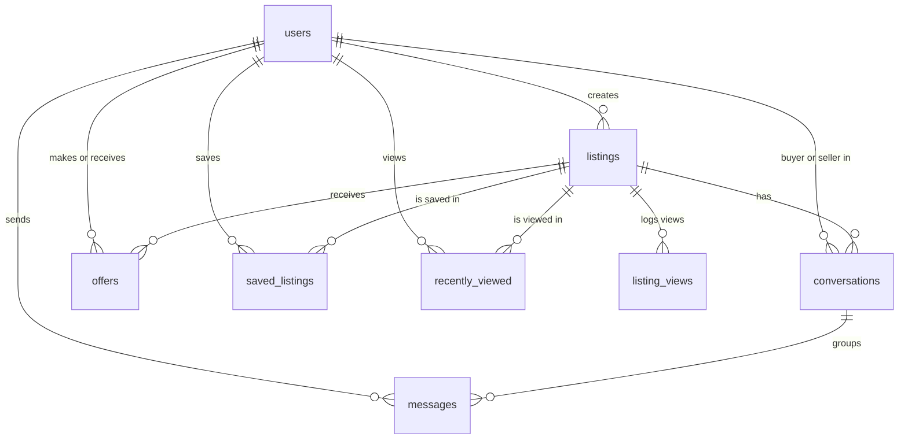

# Database Data Model: Marketplace Role Separation

This document specifies the database schemas, primary keys, foreign keys, relationships, cascade behaviors, and indexes for the **SmartBazaar AI V3 - Marketplace Role Separation** feature.

---

## Database ER Diagram (Logical)

---

## 1. Schema Specifications

### `listings` (Updated)
Tracks marketplace items.
- **`status`**: String (nullable=False, default="Active"). Allowed values: `"Active"`, `"Sold"`.
- **`views_count`**: Integer (nullable=False, default=0) - cached view counter.
- **`saves_count`**: Integer (nullable=False, default=0) - cached save counter.

### `conversations` (New Table)
Represents a unique communication channel between a buyer, seller, and a specific listing.
- **`id`**: Integer (Primary Key, Autoincrement).
- **`listing_id`**: Integer (ForeignKey -> `listings.id`, ondelete="CASCADE", nullable=False).
- **`buyer_id`**: Integer (ForeignKey -> `users.id`, ondelete="CASCADE", nullable=False).
- **`seller_id`**: Integer (ForeignKey -> `users.id`, ondelete="CASCADE", nullable=False).
- **`created_at`**: DateTime (Default: UTC Now).
- **Indexes**:
  - Unique Index on `(listing_id, buyer_id, seller_id)` to prevent duplicate threads.
  - Index on `buyer_id` for fast query of buyer chats.
  - Index on `seller_id` for fast query of seller chats.
- **Relationships**:
  - `listing`: Relationship to `Listing` (back_populates="conversations").
  - `buyer`: Relationship to `User` (foreign_keys=[buyer_id]).
  - `seller`: Relationship to `User` (foreign_keys=[seller_id]).
  - `messages`: Relationship to `Message` (back_populates="conversation", cascade="all, delete-orphan").

### `messages` (Updated Schema)
Persists chat messages within a conversation.
- **`id`**: Integer (Primary Key, Autoincrement).
- **`conversation_id`**: Integer (ForeignKey -> `conversations.id`, ondelete="CASCADE", nullable=False, index=True).
- **`sender_id`**: Integer (ForeignKey -> `users.id`, ondelete="CASCADE", nullable=False, index=True).
- **`content`**: Text (nullable=False).
- **`created_at`**: DateTime (Default: UTC Now, index=True).
- **Relationships**:
  - `conversation`: Relationship to `Conversation` (back_populates="messages").
  - `sender`: Relationship to `User`.

### `offers` (New Table)
Manages pricing offers and negotiations.
- **`id`**: Integer (Primary Key, Autoincrement).
- **`listing_id`**: Integer (ForeignKey -> `listings.id`, ondelete="CASCADE", nullable=False, index=True).
- **`buyer_id`**: Integer (ForeignKey -> `users.id`, ondelete="CASCADE", nullable=False, index=True).
- **`seller_id`**: Integer (ForeignKey -> `users.id`, ondelete="CASCADE", nullable=False, index=True).
- **`offer_amount`**: Float (nullable=False).
- **`status`**: String (nullable=False, default="Pending"). Allowed values: `"Pending"`, `"Accepted"`, `"Rejected"`, `"Expired"`.
- **`created_at`**: DateTime (Default: UTC Now).
- **`updated_at`**: DateTime (Default: UTC Now, onupdate=utcnow).
- **Indexes**:
  - Index on `(listing_id, status)` for fast active offer lookups.
  - Index on `buyer_id` for user's sent offers.
  - Index on `seller_id` for user's received offers.
- **Relationships**:
  - `listing`: Relationship to `Listing`.
  - `buyer`: Relationship to `User` (foreign_keys=[buyer_id]).
  - `seller`: Relationship to `User` (foreign_keys=[seller_id]).

### `saved_listings` / `wishlists` (New Table)
Allows buyers to save items for later viewing.
- **`id`**: Integer (Primary Key, Autoincrement).
- **`user_id`**: Integer (ForeignKey -> `users.id`, ondelete="CASCADE", nullable=False).
- **`listing_id`**: Integer (ForeignKey -> `listings.id`, ondelete="CASCADE", nullable=False).
- **`created_at`**: DateTime (Default: UTC Now).
- **Indexes**:
  - Unique Index on `(user_id, listing_id)` to prevent double saving.
- **Relationships**:
  - `user`: Relationship to `User`.
  - `listing`: Relationship to `Listing`.

### `listing_views` (New Table)
Analytics tracking for views on listings to compute conversion rates and health scores.
- **`id`**: Integer (Primary Key, Autoincrement).
- **`listing_id`**: Integer (ForeignKey -> `listings.id`, ondelete="CASCADE", nullable=False, index=True).
- **`viewer_id`**: Integer (ForeignKey -> `users.id`, ondelete="SET NULL", nullable=True, index=True).
- **`viewed_at`**: DateTime (Default: UTC Now).

### `recently_viewed` (New Table)
Saves the last visited items of a buyer for dashboard access.
- **`id`**: Integer (Primary Key, Autoincrement).
- **`user_id`**: Integer (ForeignKey -> `users.id`, ondelete="CASCADE", nullable=False, index=True).
- **`listing_id`**: Integer (ForeignKey -> `listings.id`, ondelete="CASCADE", nullable=False).
- **`viewed_at`**: DateTime (Default: UTC Now, onupdate=utcnow).
- **Indexes**:
  - Unique Index on `(user_id, listing_id)` (allows updating `viewed_at` instead of duplicating).
- **Relationships**:
  - `listing`: Relationship to `Listing`.

---

## 2. Integrity and Cascade Rules
1. **User Deletion**: On delete of a `User`, all their `listings`, `conversations`, `offers`, and `saved_listings` are deleted (`ondelete="CASCADE"`). Any of their listing views have their `viewer_id` set to `NULL` to preserve analytics statistics.
2. **Listing Deletion**: On delete of a `Listing`, all associated `conversations`, `offers`, `saved_listings`, `listing_views`, and `recently_viewed` items are deleted (`ondelete="CASCADE"`).
3. **Conversation Deletion**: On delete of a `Conversation`, all associated `messages` are deleted (`ondelete="CASCADE"`).
