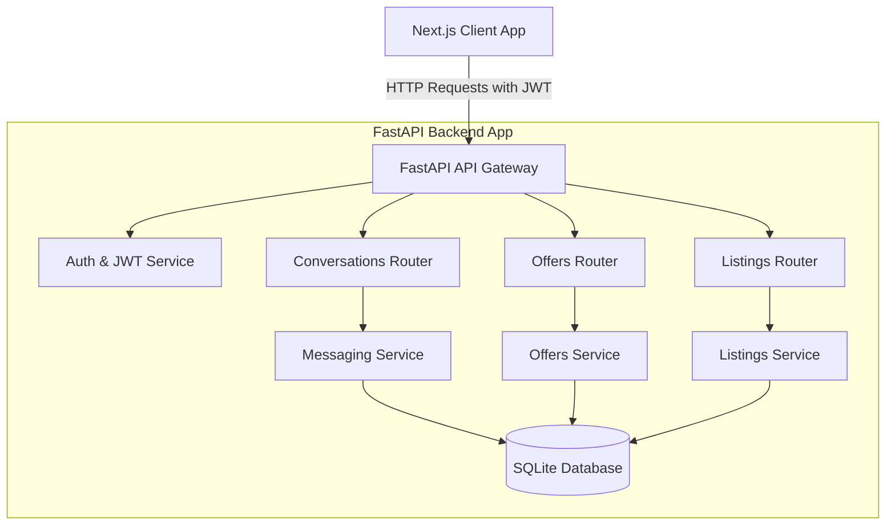
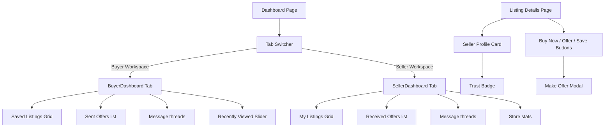

# Implementation Plan: Marketplace Role Separation & Real Buyer-Seller Ecosystem

**Branch**: `003-marketplace-role-separation` | **Date**: 2026-06-19 | **Spec**: [spec.md](file:///e:/PPT/jio%20internship/cart/specs/003-marketplace-role-separation/spec.md)

**Input**: Feature specification from `/specs/003-marketplace-role-separation/spec.md`

---

## Summary
Transform SmartBazaar AI from a listing board into a P2P marketplace by enforcing role separation, removing automated fake replies, and adding robust messaging, saved listings, and price negotiation systems. The architecture introduces distinct workspaces on the frontend (Buyer Dashboard vs. Seller Dashboard), logical models for conversations and offers, and backend authorization hooks to block self-interactions.

---

## Technical Context

**Language/Version**: Python 3.11+, TypeScript Node 20+

**Primary Dependencies**: FastAPI, SQLAlchemy, Pydantic V2, Next.js 14, Zustand, Tailwind CSS, Lucide React

**Storage**: SQLite (local development and pytest environment) / PostgreSQL (production/Docker)

**Testing**: pytest (backend API testing)

**Target Platform**: Local development via Docker Compose

**Project Type**: Monolith Web Application (FastAPI backend + Next.js frontend)

**Performance Goals**: Tab switching < 150ms; API response times for dashboard feeds < 300ms; backend authorization checks < 20ms

**Constraints**: Local deployment with zero paid cloud integrations, strict ORM parameterization, theme consistency persistence (light/dark/system)

---

## Constitution Check

*GATE: Must pass before Phase 0 research. Re-check after Phase 1 design.*

- **Security First**: All new API parameters validated via Pydantic V2 models. Backend endpoints verify that caller IDs do not match the listing seller ID for buyer actions (Save, Offer, Chat, Buy Now). SQLAlchemy models parameterized dynamically. (Pass)
- **AI Transparency & Explainable AI**: The Trust Score and Listing Health scoring processes return explainable metrics. Badges are properly styled. (Pass)
- **Monolith Enforcement**: Monolithic repository design separating frontend and backend workspace folders. (Pass)
- **Internship Scope**: SQLite local file databases used with local seeding, maintaining 100% offline capability. (Pass)

---

## System Architecture



---

## Frontend Component Architecture



---

## Project Structure

### Documentation (this feature)
```text
specs/003-marketplace-role-separation/
├── plan.md              # This file
├── research.md          # Architectural research and rationale
├── data-model.md        # Database schema specifications
├── quickstart.md        # Validation scenarios and setup scripts
└── checklists/
    └── requirements.md  # Specification quality checklist
```

### Source Code Changes (Target Files)
```text
backend/
├── app/
│   ├── models/
│   │   ├── conversation.py        # [NEW] Conversation model
│   │   ├── offer.py               # [NEW] Offer model
│   │   ├── saved_listing.py       # [NEW] SavedListing model
│   │   ├── listing_view.py        # [NEW] ListingView model
│   │   ├── recently_viewed.py     # [NEW] RecentlyViewed model
│   │   ├── listing.py             # [MODIFY] Add status and cache metrics
│   │   └── message.py             # [MODIFY] Change from listing_id to conversation_id FK
│   ├── routers/
│   │   ├── conversations.py       # [NEW] Conversations & Messages API
│   │   ├── offers.py              # [NEW] Offers CRUD and status state machine
│   │   ├── dashboard.py           # [NEW] Aggregate data router for dashboards
│   │   ├── listings.py            # [MODIFY] Add save/unsave routes
│   │   └── messages.py            # [DELETE] Remove old file in favor of conversations
│   ├── schemas/
│   │   ├── conversation.py        # [NEW] Pydantic schemas
│   │   ├── offer.py               # [NEW] Pydantic schemas
│   │   └── dashboard.py           # [NEW] Pydantic schemas
│   ├── services/
│   │   ├── conversation_service.py # [NEW] Chat management logic
│   │   ├── offer_service.py       # [NEW] Offers management & expiry logic
│   │   └── dashboard_service.py   # [NEW] Aggregate query optimization
│   └── seed.py                    # [MODIFY] Update seed mock data with conversations & offers
frontend/
├── src/
│   ├── app/
│   │   ├── dashboard/
│   │   │   └── page.tsx           # [MODIFY] Dual-tab buyer & seller workspace
│   │   └── listing/
│   │       └── [id]/
│   │           └── page.tsx       # [MODIFY] Enforce buy/offer/save visibility rules, Seller Card
│   └── components/
│       ├── SellerProfileCard.tsx  # [NEW] Display trust metrics for listing owners
│       ├── OfferModal.tsx         # [NEW] Pop-up to make a custom price offer
│       ├── BuyerDashboard.tsx     # [NEW] Saved, offers sent, messages
│       └── SellerDashboard.tsx    # [NEW] Listings, offers received, analytics, trust
```

---

## Migration Plan

### SQLite Local Environment
1. SQLite does not require migrations script execution locally. The simplest, cleanest, and most reliable method is to delete the `db.sqlite3` file and run `python backend/app/seed.py`.
2. The `seed.py` script automatically runs `drop_all()` and `create_all()`, ensuring the new tables (`conversations`, `offers`, `saved_listings`, `listing_views`, `recently_viewed`) are registered and generated correctly.
3. Seeding logic will be updated to load mock conversations, messages, offers, and saved listings.

### PostgreSQL Production Environment
If deployed to production, run DDL SQL scripts to create new tables and update existing ones:
```sql
ALTER TABLE listings ADD COLUMN status VARCHAR(20) DEFAULT 'Active' NOT NULL;
ALTER TABLE listings ADD COLUMN views_count INTEGER DEFAULT 0 NOT NULL;
ALTER TABLE listings ADD COLUMN saves_count INTEGER DEFAULT 0 NOT NULL;

-- DDL for conversations, offers, saved_listings, recently_viewed, listing_views
```

---

## Implementation Strategy

### Phase 1: Backend Foundations
1. Implement the database models for `Conversation`, `Offer`, `SavedListing`, `ListingView`, and `RecentlyViewed`.
2. Refactor the existing `Message` model to link to `Conversation` instead of `Listing` directly.
3. Update `seed.py` and run it to initialize database structures.

### Phase 2: Core Backend Services and API Routers
1. Create `ConversationService` and `ConversationsRouter` for starting chats, listing active message threads, and appending message strings.
2. Create `OfferService` and `OffersRouter` implementing the state transitions (`Pending` -> `Accepted`/`Rejected`/`Expired`).
3. Create `DashboardService` aggregating statistics (listing views, offer count, active conversations) for both buyer and seller roles.
4. Implement input validations and guards to ensure users cannot save, chat, or offer on their own listings.

### Phase 3: Frontend Layouts and Interactions
1. Implement the tab-switcher on `/dashboard` to load `BuyerDashboard` and `SellerDashboard` subsections.
2. Update the Listing Detail page to render the `SellerProfileCard` showing seller metrics.
3. Integrate the "Save Listing" toggle (heart icon), "Make Offer" modal overlay, and "Buy Now" confirmation logic.
4. Enforce visibility rules (hide buttons for listing owners).

### Phase 4: Verification and QA testing
1. Write backend Pytest cases covering self-interaction guards, offer acceptance flows, message delivery verification, and dashboard loading parameters.
2. Execute end-to-end user journeys manually inside browser workspaces.
