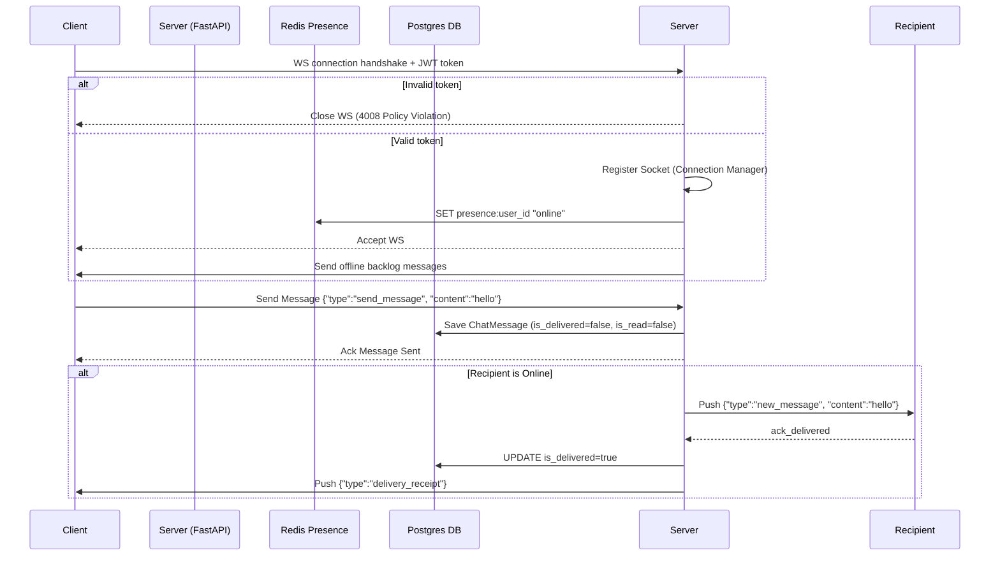

# API Contract: WebSocket Schema

This document defines the real-time event schemas, connection handshakes, and payload layouts for the unified chat WebSocket route.

Gateway Route: `WS /api/v2/chat/ws?token=<JWT_ACCESS_TOKEN>`

---

## 1. Connection Protocol

1. **Client Handshake**: Client initiates connection to the WS endpoint, passing the JWT in the query parameter.
2. **Server Auth Checks**:
   * If token is missing, expired, or invalid, the server rejects the handshake and closes the connection with code `4008 Policy Violation`.
   * On success, server registers connection, updates presence key in Redis to `"online"`, and broadcasts `presence_update` to active chat contacts.
3. **Heartbeat Loop**: Client must send a ping event every 30 seconds to maintain connection. Server automatically prunes clients who fail to ping for 60 seconds.

---

## 2. Event Types & Schemas

All payloads are serialized as JSON. Every WebSocket envelope contains a `type` string field indicating how the parser should route the message.

---

### Client-to-Server Payloads

#### Event: `send_message`
* **Purpose**: Dispatch a new text message.
* **Payload**:
  ```json
  {
    "type": "send_message",
    "conversation_id": 2045,
    "content": "Hi Sameer, is this still available?"
  }
  ```

#### Event: `typing_status`
* **Purpose**: Notify that the user is typing in a thread.
* **Payload**:
  ```json
  {
    "type": "typing_status",
    "conversation_id": 2045,
    "is_typing": true
  }
  ```

#### Event: `mark_read`
* **Purpose**: Notify that the user has opened the conversation and read messages.
* **Payload**:
  ```json
  {
    "type": "mark_read",
    "conversation_id": 2045
  }
  ```

#### Event: `ping`
* **Purpose**: Client heartbeat ping check.
* **Payload**:
  ```json
  {
    "type": "ping"
  }
  ```

---

### Server-to-Client Payloads

#### Event: `new_message`
* **Purpose**: Push an incoming chat message in real-time.
* **Payload**:
  ```json
  {
    "type": "new_message",
    "message_id": 9846,
    "conversation_id": 2045,
    "sender_id": 12,
    "content": "Hi Sameer, is this still available?",
    "message_type": "text",
    "media_url": null,
    "created_at": "2026-06-23T16:32:00Z"
  }
  ```

#### Event: `typing_indicator`
* **Purpose**: Notify that the chat partner is typing.
* **Payload**:
  ```json
  {
    "type": "typing_indicator",
    "conversation_id": 2045,
    "user_id": 12,
    "is_typing": true
  }
  ```

#### Event: `delivery_receipt`
* **Purpose**: Confirm a message has reached the recipient client.
* **Payload**:
  ```json
  {
    "type": "delivery_receipt",
    "conversation_id": 2045,
    "message_id": 9846,
    "is_delivered": true,
    "timestamp": "2026-06-23T16:32:05Z"
  }
  ```

#### Event: `read_receipt`
* **Purpose**: Confirm the message has been opened.
* **Payload**:
  ```json
  {
    "type": "read_receipt",
    "conversation_id": 2045,
    "message_id": 9846,
    "is_read": true,
    "timestamp": "2026-06-23T16:34:00Z"
  }
  ```

#### Event: `presence_update`
* **Purpose**: Notify contacts of a partner’s status change.
* **Payload**:
  ```json
  {
    "type": "presence_update",
    "user_id": 34,
    "is_online": true,
    "last_active_at": "2026-06-23T16:32:00Z"
  }
  ```

#### Event: `error`
* **Purpose**: Broadcast execution failures.
* **Payload**:
  ```json
  {
    "type": "error",
    "code": 403,
    "message": "You are not a participant in this conversation."
  }
  ```

---

## 3. WebSocket Connection State Flow



---

**Version**: 1.0.0 | **Ratified**: Pending | **Last Amended**: 2026-06-23
