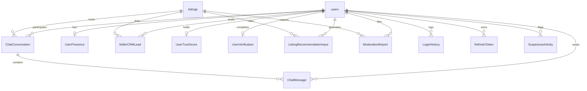
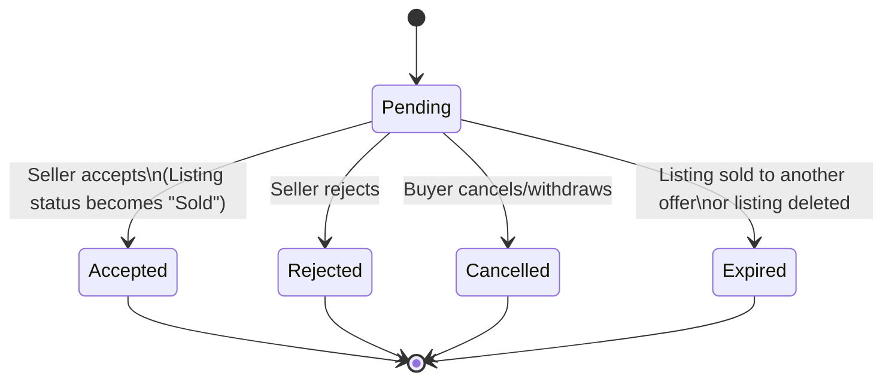
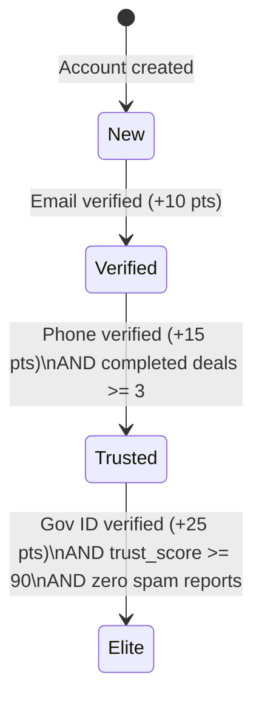
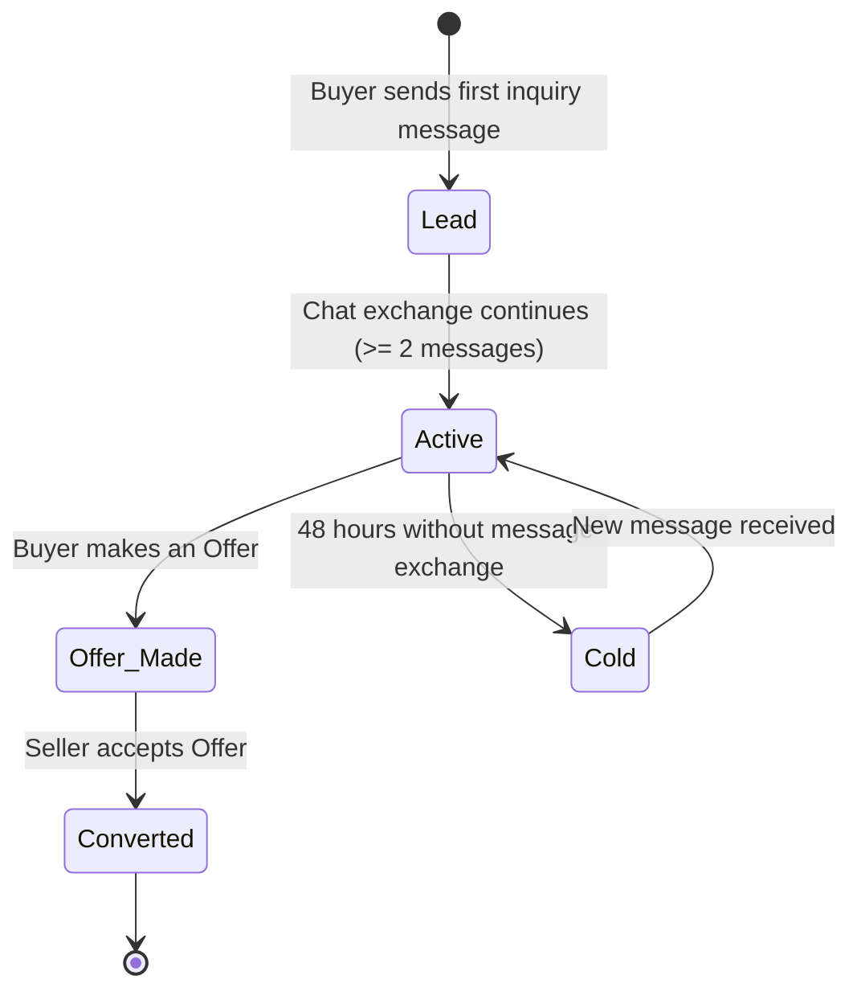

# Data Model Design: SmartBazaar V2

This document defines the relational database entities, indices, caching layout (Redis), state transitions, and validation rules for SmartBazaar V2.

---

## 1. Entity ERD & Layout (SQL Database)

All tables cascade delete on user or listing deletions except where specified otherwise to maintain historical logging integrity.

### Table: `conversations` (ChatConversation)
Stores conversation headers. Only one conversation is allowed per (Listing, Buyer).
* `id` (Integer, Primary Key, Autoincrement)
* `listing_id` (Integer, ForeignKey -> `listings.id`, ON DELETE CASCADE, Indexed, NOT NULL)
* `buyer_id` (Integer, ForeignKey -> `users.id`, ON DELETE CASCADE, Indexed, NOT NULL)
* `seller_id` (Integer, ForeignKey -> `users.id`, ON DELETE CASCADE, Indexed, NOT NULL)
* `is_archived_buyer` (Boolean, DEFAULT False, NOT NULL)
* `is_archived_seller` (Boolean, DEFAULT False, NOT NULL)
* `is_pinned_buyer` (Boolean, DEFAULT False, NOT NULL)
* `is_pinned_seller` (Boolean, DEFAULT False, NOT NULL)
* `created_at` (DateTime, DEFAULT UTC_NOW, NOT NULL)
* **Constraints**:
  * UNIQUE (`listing_id`, `buyer_id`)
* **Indexes**:
  * `idx_conversation_participants`: (`buyer_id`, `seller_id`)
  * `idx_conversation_listing`: (`listing_id`)

### Table: `messages` (ChatMessage)
Stores individual chat messages and media payloads.
* `id` (Integer, Primary Key, Autoincrement)
* `conversation_id` (Integer, ForeignKey -> `conversations.id`, ON DELETE CASCADE, Indexed, NOT NULL)
* `sender_id` (Integer, ForeignKey -> `users.id`, ON DELETE CASCADE, Indexed, NOT NULL)
* `content` (Text, Nullable = True)
* `message_type` (String, DEFAULT "text", NOT NULL) -- values: "text", "image", "voice", "offer", "system"
* `media_url` (String, Nullable = True) -- Path to local volume upload
* `is_delivered` (Boolean, DEFAULT False, NOT NULL)
* `is_read` (Boolean, DEFAULT False, NOT NULL)
* `created_at` (DateTime, DEFAULT UTC_NOW, NOT NULL)
* **Constraints**:
  * CHECK (`content` IS NOT NULL OR `media_url` IS NOT NULL)
* **Indexes**:
  * `idx_message_thread`: (`conversation_id`, `created_at`)

### Table: `online_status` (UserPresence)
Tracks real-time user activity. Kept in DB for fallback sync.
* `user_id` (Integer, Primary Key, ForeignKey -> `users.id`, ON DELETE CASCADE, NOT NULL)
* `is_online` (Boolean, DEFAULT False, NOT NULL)
* `last_active_at` (DateTime, DEFAULT UTC_NOW, NOT NULL)
* `current_conversation_id` (Integer, ForeignKey -> `conversations.id`, ON DELETE SET NULL, Nullable = True)

### Table: `offer_funnel` (SellerCRMLead)
Integrates buyers into the seller’s CRM pipeline per listing thread.
* `id` (Integer, Primary Key, Autoincrement)
* `seller_id` (Integer, ForeignKey -> `users.id`, ON DELETE CASCADE, Indexed, NOT NULL)
* `buyer_id` (Integer, ForeignKey -> `users.id`, ON DELETE CASCADE, Indexed, NOT NULL)
* `listing_id` (Integer, ForeignKey -> `listings.id`, ON DELETE CASCADE, Indexed, NOT NULL)
* `lead_status` (String, DEFAULT "lead", NOT NULL) -- values: "lead", "active", "offer_made", "converted", "cold"
* `notes` (Text, Nullable = True)
* `last_contacted_at` (DateTime, DEFAULT UTC_NOW, NOT NULL)
* `created_at` (DateTime, DEFAULT UTC_NOW, NOT NULL)
* **Constraints**:
  * UNIQUE (`seller_id`, `buyer_id`, `listing_id`)
* **Indexes**:
  * `idx_crm_pipeline`: (`seller_id`, `lead_status`)

### Table: `buyer_trust_scores` (UserTrustScore)
Maintains computed trust ratios.
* `id` (Integer, Primary Key, Autoincrement)
* `user_id` (Integer, ForeignKey -> `users.id`, ON DELETE CASCADE, UNIQUE, Indexed, NOT NULL)
* `trust_score` (Integer, DEFAULT 50, NOT NULL) -- Bound: 0 to 100
* `completed_deals_count` (Integer, DEFAULT 0, NOT NULL)
* `cancellation_rate` (Float, DEFAULT 0.0, NOT NULL)
* `response_rate` (Float, DEFAULT 100.0, NOT NULL)
* `spam_reports_count` (Integer, DEFAULT 0, NOT NULL)
* `last_calculated_at` (DateTime, DEFAULT UTC_NOW, NOT NULL)
* **Indexes**:
  * `idx_trust_score_rank`: (`trust_score`)

### Table: `seller_verifications` (UserVerification)
Tracks credential validations.
* `id` (Integer, Primary Key, Autoincrement)
* `user_id` (Integer, ForeignKey -> `users.id`, ON DELETE CASCADE, UNIQUE, Indexed, NOT NULL)
* `email_verified` (Boolean, DEFAULT False, NOT NULL)
* `phone_verified` (Boolean, DEFAULT False, NOT NULL)
* `id_verified` (Boolean, DEFAULT False, NOT NULL)
* `verification_level` (String, DEFAULT "New", NOT NULL) -- values: "New", "Verified", "Trusted", "Elite"
* `id_document_url` (String, Nullable = True) -- Encrypted upload path
* `updated_at` (DateTime, DEFAULT UTC_NOW, NOT NULL)

### Table: `buyer_interactions` (ListingRecommendationInput & Viewing History)
Stores event inputs to feed the personalized recommendation logic.
* `id` (Integer, Primary Key, Autoincrement)
* `user_id` (Integer, ForeignKey -> `users.id`, ON DELETE CASCADE, Indexed, NOT NULL)
* `listing_id` (Integer, ForeignKey -> `listings.id`, ON DELETE CASCADE, Indexed, NOT NULL)
* `action_type` (String, NOT NULL) -- values: "view", "save", "offer", "chat"
* `weight` (Float, NOT NULL) -- e.g. view = 0.1, save = 0.3, offer = 0.8, chat = 1.0
* `created_at` (DateTime, DEFAULT UTC_NOW, NOT NULL)
* **Indexes**:
  * `idx_user_interaction_flow`: (`user_id`, `action_type`, `created_at`)

### Table: `reports` (ModerationReport)
Stores reported listings and users.
* `id` (Integer, Primary Key, Autoincrement)
* `reporter_id` (Integer, ForeignKey -> `users.id`, ON DELETE CASCADE, Indexed, NOT NULL)
* `listing_id` (Integer, ForeignKey -> `listings.id`, ON DELETE SET NULL, Nullable = True, Indexed)
* `reported_user_id` (Integer, ForeignKey -> `users.id`, ON DELETE SET NULL, Nullable = True, Indexed)
* `report_type` (String, NOT NULL) -- values: "spam", "scam", "abuse", "inappropriate"
* `description` (Text, NOT NULL)
* `status` (String, DEFAULT "pending", NOT NULL) -- values: "pending", "resolved", "dismissed"
* `action_taken` (String, Nullable = True)
* `created_at` (DateTime, DEFAULT UTC_NOW, NOT NULL)
* **Indexes**:
  * `idx_moderation_queue`: (`status`, `created_at`)

### Table: `login_history`
Tracks active sessions for security logs.
* `id` (Integer, Primary Key, Autoincrement)
* `user_id` (Integer, ForeignKey -> `users.id`, ON DELETE CASCADE, Indexed, NOT NULL)
* `ip_address` (String, NOT NULL)
* `user_agent` (String, NOT NULL)
* `status` (String, NOT NULL) -- values: "success", "failed"
* `created_at` (DateTime, DEFAULT UTC_NOW, NOT NULL)
* **Indexes**:
  * `idx_user_logins`: (`user_id`, `created_at`)

### Table: `refresh_tokens`
Stores SHA-256 hashed refresh tokens for RTR.
* `id` (Integer, Primary Key, Autoincrement)
* `user_id` (Integer, ForeignKey -> `users.id`, ON DELETE CASCADE, Indexed, NOT NULL)
* `token_hash` (String, Unique, Indexed, NOT NULL)
* `device_id` (String, NOT NULL)
* `expires_at` (DateTime, NOT NULL)
* `is_revoked` (Boolean, DEFAULT False, NOT NULL)
* `created_at` (DateTime, DEFAULT UTC_NOW, NOT NULL)

### Table: `suspicious_activity`
Records security alerts for automated IP throttling or brute-force tracking.
* `id` (Integer, Primary Key, Autoincrement)
* `user_id` (Integer, ForeignKey -> `users.id`, ON DELETE CASCADE, Nullable = True, Indexed)
* `ip_address` (String, Indexed, NOT NULL)
* `activity_type` (String, NOT NULL) -- values: "brute_force_throttled", "replay_attack_detected", "media_size_exceeded", "blacklisted_keyword_flagged"
* `details` (Text, Nullable = True)
* `created_at` (DateTime, DEFAULT UTC_NOW, NOT NULL)

---

## 2. Redis Cache Keys & Structures

Redis is utilized for high-throughput, transient messaging states, feed caches, and rate-limiting counters.

| Component | Redis Key Schema | Data Type | TTL | Description |
| :--- | :--- | :--- | :--- | :--- |
| **Presence** | `presence:{user_id}` | String | 3 minutes | Value is `"online"` or `"offline"`. Keeps socket status. |
| **Typing Indicator** | `typing:{conv_id}:{user_id}` | String | 5 seconds | Temporary flag representing user typing. Expired automatically. |
| **Unread Messages** | `unread:{conv_id}:{user_id}` | String (Integer)| Infinite | Integer counter of unread messages for that participant. |
| **Recommendation** | `rec:{user_id}` | List (JSON) | 1 hour | Array of serialized listing recommendation matches. |
| **Rate Limiter (IP)**| `rate:ip:{ip_address}:{window_timestamp}`| String (Int) | 15 minutes | Request count inside a 15-minute sliding window. |
| **Active Sockets** | `socket:registry` | Hash Map | Infinite | Maps `user_id -> instance_ip` for pub/sub message routing. |

---

## 3. State Transitions

### Offer Lifecycle

### Verification Level Escalation

### Seller CRM Lead Pipeline

---

## 4. Input Validation Rules (Pydantic Bounds)

* **Chat Media Payload**: File size MUST be $\le 5$ MB. MIME type MUST be in: `[image/jpeg, image/png, audio/mpeg, audio/wav, audio/ogg]`.
* **CRM Note Payload**: Length MUST be $\le 1000$ characters. Rich HTML/Javascript strings are stripped.
* **Copilot Text Query**: Length MUST be between 3 and 250 characters. Filters out non-ascii control symbols.
* **Identity Verification File**: Size MUST be $\le 10$ MB. MIME type MUST be `application/pdf` or `image/jpeg`.

---

**Version**: 1.0.0 | **Ratified**: Pending | **Last Amended**: 2026-06-23
