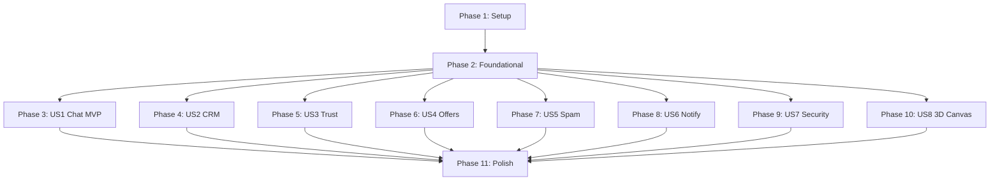

# Tasks: SmartBazaar V2 Marketplace Platform

**Input**: Design documents from `/specs/004-marketplace-v2-platform/`

**Prerequisites**: [plan.md](file:///e:/PPT/jio%20internship/cart/specs/004-marketplace-v2-platform/plan.md) (required), [spec.md](file:///e:/PPT/jio%20internship/cart/specs/004-marketplace-v2-platform/spec.md) (required for user stories), [research.md](file:///e:/PPT/jio%20internship/cart/specs/004-marketplace-v2-platform/research.md), [data-model.md](file:///e:/PPT/jio%20internship/cart/specs/004-marketplace-v2-platform/data-model.md), [rest.md](file:///e:/PPT/jio%20internship/cart/specs/004-marketplace-v2-platform/contracts/rest.md), [websocket.md](file:///e:/PPT/jio%20internship/cart/specs/004-marketplace-v2-platform/contracts/websocket.md)

**Tests**: Tests are requested via testing tasks (TEST-01 to TEST-10). They are placed at the beginning of each relevant User Story phase.

**Organization**: Tasks are grouped by user story to enable independent implementation and testing of each story.

---

## Format: `[ID] [P?] [Story] Description`

- **[P]**: Can run in parallel (different files, no dependencies)
- **[Story]**: Which user story this task belongs to (e.g. US1, US2, US3)
- Include exact file paths in descriptions

---

## Path Conventions
* **Backend**: Python FastAPI logic under `backend/app/`
* **Frontend**: TypeScript Next.js logic under `frontend/src/`

---

## Phase 1: Setup (Shared Infrastructure)

**Purpose**: Project initialization, volume configurations, and Redis driver setup.

- [ ] T001 Initialize local upload volume folders in `docker-compose.yml` mounts
- [ ] T002 Configure Redis client connection manager in `backend/app/core/redis.py`
- [ ] T003 Configure file upload size and MIME boundary checks in `backend/app/core/config.py`
- [ ] T004 [P] Set up Three.js static folders and place `Laptop.glb`, `Car.glb`, `Book.glb`, `Chair.glb` in `frontend/public/assets/`

---

## Phase 2: Foundational (Blocking Prerequisites)

**Purpose**: Database schema tables and unified routing frameworks.

- [ ] T005 Run Alembic migration to create all tables (conversations, messages, crm_leads, trust_scores, verifications, reports, tokens) in `backend/app/models/`
- [ ] T006 [P] Implement authentication middleware for WebSockets verification in `backend/app/core/auth.py`
- [ ] T007 [P] Create database models for chat entities in `backend/app/models/chat.py`
- [ ] T008 [P] Create database models for CRM, trust, and verifications in `backend/app/models/crm.py`
- [ ] T009 Create base schemas and bounds verification in `backend/app/schemas/chat.py` and `backend/app/schemas/crm.py`

**Checkpoint**: Foundation ready - user story implementation can now begin.

---

## Phase 3: User Story 1 — Real-Time Chat & Advanced Messaging (Priority: P1) 🎯 MVP

**Goal**: Establish WebSocket messaging system, image/voice note transfers, reactions, chat pinning, and archiving.

**Independent Test**: Connect wscat clients, message, upload images/voice notes, reactions, and check search logs.

### Tests for User Story 1
- [ ] T010 [P] [US1] TEST-01 Implement WebSocket reconnection logic tests in `frontend/src/tests/chat_socket.test.ts`
- [ ] T011 [P] [US1] TEST-02 Implement typing status broadcast validation tests in `backend/tests/websocket/test_typing.py`
- [ ] T012 [P] [US1] TEST-07 Implement Block user API boundary test in `backend/tests/integration/test_blocking.py`
- [ ] T013 [P] [US1] TEST-09 Implement archived conversation route checks in `backend/tests/integration/test_archive.py`

### Implementation for User Story 1
- [ ] T014 [US1] Implement `WebSocketConnectionManager` routing loop in `backend/app/services/websocket_manager.py`
- [ ] T015 [US1] CHAT-01 Implement voice message upload controller and waveform metadata parser in `backend/app/routers/media.py`
- [ ] T016 [US1] CHAT-02 Implement listing image upload helper and preview layout in `frontend/src/components/ImageUploader.tsx`
- [ ] T017 [US1] CHAT-03 Implement message reaction endpoints (`POST /api/v2/chat/messages/{id}/react`) in `backend/app/routers/chat.py`
- [ ] T018 [US1] CHAT-04 Implement quoted replies logic in `backend/app/schemas/chat.py` and render in `frontend/src/components/ChatBubble.tsx`
- [ ] T019 [US1] CHAT-05 CHAT-06 Implement text query message search and chat list search filters in `backend/app/repositories/chat_repository.py`
- [ ] T020 [US1] CHAT-07 CHAT-08 CHAT-09 Implement Pin/Archive/Mute controllers in `backend/app/routers/chat.py` and toggle states in `frontend/src/stores/chatStore.ts`
- [ ] T021 [US1] CHAT-10 Implement Block user endpoints (`POST /api/v2/users/block/{id}`) and update participant validation query in `backend/app/services/chat_service.py`
- [ ] T022 [US1] Build the unified chat workspace view in `frontend/src/pages/messages/page.tsx`

**Checkpoint**: User Story 1 is functional with advanced messaging features.

---

## Phase 4: User Story 2 — Seller CRM Pipeline & Lead Scoring (Priority: P1)

**Goal**: Build the CRM workspace, categorize buyers, log notes, and show pipeline charts.

**Independent Test**: Load the seller CRM dashboard, change a lead's stage, write private notes, and view the conversion funnel charts.

### Tests for User Story 2
- [ ] T023 [P] [US2] Create integration tests for lead score transitions in `backend/tests/integration/test_crm_pipeline.py`
- [ ] T024 [P] [US2] Create unit tests for funnel analytics aggregator in `backend/tests/unit/test_crm_analytics.py`

### Implementation for User Story 2
- [ ] T025 [US2] CRM-02 Implement the Buyer Lead Score algorithm (based on messages, offers, views, saves) in `backend/app/services/crm_service.py`
- [ ] T026 [US2] CRM-03 Categorize buyers into pipeline status tags (`Hot`, `Warm`, `Cold`, `Inactive`) in `backend/app/repositories/crm_repository.py`
- [ ] T027 [US2] CRM-04 Implement the private conversation notes route (`POST /api/v2/crm/leads/{id}/notes`) in `backend/app/routers/crm.py`
- [ ] T028 [US2] CRM-05 CRM-06 Implement conversation status labels and buyer action timeline logs in `backend/app/services/crm_service.py`
- [ ] T029 [US2] CRM-01 Build the Seller CRM Workspace page with pipeline boards and funnel charts in `frontend/src/pages/seller/crm.tsx`

**Checkpoint**: Seller CRM is fully functional, linking inquiries to deal conversions.

---

## Phase 5: User Story 3 — Trust System & Verification Badge Network (Priority: P2)

**Goal**: Implement trust score recalculation jobs, verification upload files, and trust rating widgets.

**Independent Test**: Complete verification tasks, check trust score recalculation, and verify badges on listing profiles.

### Tests for User Story 3
- [ ] T030 [P] [US3] TEST-08 Implement user report and block flow tests in `backend/tests/integration/test_reporting.py`
- [ ] T031 [P] [US3] Create integration tests for trust score calculation intervals in `backend/tests/unit/test_trust_score.py`

### Implementation for User Story 3
- [ ] T032 [US3] SAFE-03 Implement the Scam Risk Engine and Trust score calculations in `backend/app/services/trust_service.py`
- [ ] T033 [US3] SAFE-04 SAFE-05 Create Report User and Report Conversation endpoints in `backend/app/routers/moderation.py`
- [ ] T034 [US3] Build the document verification uploader and status page in `frontend/src/pages/profile/verify.tsx`
- [ ] T035 [US3] Integrate verification level visual badges (Elite, Trusted, Verified) in `frontend/src/components/SellerProfileCard.tsx`

**Checkpoint**: Trust and safety badges are rendered correctly across the platform.

---

## Phase 6: User Story 4 — Offer Integration & Chat Negotiations (Priority: P2)

**Goal**: Integrate offer message cards in chat, accept/reject actions, counter-offers, and negotiation history.

**Independent Test**: Open chat, send an offer card, perform counters, and click accept to mark the listing as sold.

### Tests for User Story 6
- [ ] T036 [P] [US4] TEST-06 Implement the offer negotiation state transition tests in `backend/tests/integration/test_negotiations.py`

### Implementation for User Story 6
- [ ] T037 [US4] OFFER-01 Render the interactive offer card payload in `frontend/src/components/ChatOfferCard.tsx`
- [ ] T038 [US4] OFFER-02 OFFER-03 Implement Accept and Reject offer callbacks directly from the chat conversation thread in `backend/app/services/chat_service.py`
- [ ] T039 [US4] OFFER-04 Implement the counter-offer mechanism and schema boundaries in `backend/app/routers/offers.py`
- [ ] T040 [US4] OFFER-05 Build the negotiation history timeline panel in `frontend/src/components/NegotiationTimeline.tsx`

**Checkpoint**: Offers are negotiated and resolved directly inside the message window.

---

## Phase 7: User Story 5 — Spam Filters & Auto-Moderator (Priority: P2)

**Goal**: Spam keyword detection, repeated message checks, and automatic content flagging.

**Independent Test**: Try to post messages containing "WhatsApp" or "Crypto" repeatedly. Check that they trigger spam flags.

### Tests for User Story 7
- [ ] T041 [P] [US5] TEST-05 Implement spam filter regex and frequency checker unit tests in `backend/tests/unit/test_spam_detection.py`

### Implementation for User Story 7
- [ ] T042 [US5] SAFE-01 Implement text scanners filtering blacklisted keywords (WhatsApp, Telegram, Crypto) in `backend/app/services/moderation_service.py`
- [ ] T043 [US5] SAFE-02 Implement sliding window Redis checks detecting identical repeated messages in `backend/app/services/moderation_service.py`
- [ ] T044 [US5] Build the admin moderation queue review dashboard in `frontend/src/pages/admin/moderation.tsx`

**Checkpoint**: Spam content is auto-flagged, and users are blocked from spamming threads.

---

## Phase 8: User Story 6 — WebSockets Notifications & Presence (Priority: P2)

**Goal**: Unread indicators, message notifications, and presence caches.

**Independent Test**: Connect client, disconnect, check online/offline indicators and unread message counters.

### Tests for User Story 8
- [ ] T045 [P] [US6] TEST-03 Implement presence socket indicator tests in `backend/tests/websocket/test_presence.py`
- [ ] T046 [P] [US6] TEST-04 Implement unread count increments tests in `backend/tests/websocket/test_unread_counters.py`

### Implementation for User Story 8
- [ ] T047 [US6] NOTIFY-01 NOTIFY-02 NOTIFY-03 NOTIFY-04 NOTIFY-05 Implement real-time client push notifications in `frontend/src/services/notificationService.ts`
- [ ] T048 [US6] PERF-03 PERF-04 Integrate Redis cache keys for presence status and unread counters in `backend/app/core/redis.py`
- [ ] T049 [US6] Implement unread counter increments and resets in `backend/app/services/chat_service.py`

**Checkpoint**: Notifications are real-time, and unread counters display correctly in the navigation bar.

---

## Phase 9: User Story 7 — Advanced Session Security (Priority: P3)

**Goal**: JWT rotation, login logs, device tracking, and session revocation.

**Independent Test**: Verify access token refresh, replay old token (confirm logout), and view device logs page.

### Implementation for User Story 9
- [ ] T050 [US7] Implement Refresh Token Rotation (RTR) logic in `backend/app/core/auth.py`
- [ ] T051 [US7] Log IP and user agent headers in `backend/app/routers/auth.py` on login attempts
- [ ] T052 [US7] Create the device tracking and session revocation endpoints in `backend/app/routers/auth.py`
- [ ] T053 [US7] Build the Security and Sessions Management UI under `frontend/src/pages/settings/security.tsx`

**Checkpoint**: Sessions are rotated and tracked securely.

---

## Phase 10: User Story 8 — WebGL 3D Globe & UI Themes (Priority: P3)

**Goal**: Render Three.js globe and pre-packaged GLTF assets, Framer Motion transitions, and theme selector.

**Independent Test**: Open landing page, verify 3D elements, simulate WebGL crash, and confirm the 2D illustration displays.

### Tests for User Story 10
- [ ] T054 [P] [US8] TEST-10 Implement mobile responsive layouts and theme selector checks in `frontend/src/tests/premium_ui.test.tsx`

### Implementation for User Story 10
- [ ] T055 [US8] Implement the 3D rotating trade globe in R3F in `frontend/src/components/ThreeGlobe.tsx`
- [ ] T056 [US8] Implement category-specific `.glb` asset loads (Laptop, Car, Book, Chair) in `frontend/src/components/ProductShowcase3D.tsx`
- [ ] T057 [US8] Implement the WebGL loss context handler and dynamic FPS fallback in `frontend/src/components/WebGLCanvasWrapper.tsx`
- [ ] T058 [US8] Build the theme persistence store syncing selector values to localStorage in `frontend/src/stores/themeStore.ts`

**Checkpoint**: Visual experience loads performantly with bulletproof fallbacks.

---

## Phase 11: Polish & Cross-Cutting Concerns

**Purpose**: Performance caching tuning, code cleanups, and final quickstart checks.

- [ ] T059 PERF-02 Integrate Redis query cache for listings and categories in `backend/app/services/listing_service.py`
- [ ] T060 PERF-01 Implement cursor-based infinite scroll for chat messages in `backend/app/routers/chat.py`
- [ ] T061 [P] Update API documentation and write setup manual in `docs/v2-deployment.md`
- [ ] T062 Run full E2E validation script specified in [quickstart.md](file:///e:/PPT/jio%20internship/cart/specs/004-marketplace-v2-platform/quickstart.md)

---

## Dependencies & Execution Order

### Phase Dependencies


### Parallel Opportunities
1. **Infrastructure**: Setup tasks T003-T004 can run concurrently.
2. **Foundations**: Authentication checks T006 and Database models T007-T008 can be built in parallel.
3. **User Stories (Phase 3+)**: Once foundations are verified, different developers can work on US1 (Chat), US2 (CRM), and US8 (3D Globe) independently since they occupy decoupled directories.

---

## Parallel Example: User Story 1

```bash
# Launch test builds in parallel:
Task: "TEST-01 Implement WebSocket reconnection logic tests in frontend/src/tests/chat_socket.test.ts"
Task: "TEST-02 Implement typing status broadcast validation tests in backend/tests/websocket/test_typing.py"

# Set up endpoints and components concurrently:
Task: "CHAT-01 Implement voice message upload controller in backend/app/routers/media.py"
Task: "CHAT-02 Implement listing image upload helper in frontend/src/components/ImageUploader.tsx"
```

---

## Implementation Strategy

### MVP First (User Story 1 Only)
1. Complete Setup and Foundational constraints.
2. Build User Story 1 (Core WebSocket chat, text messaging, and inbox).
3. **Stop and Validate**: Connect `wscat` and verify basic real-time delivery and unread count logs before moving to CRM and trust networks.

---

## Notes
* Write TDD test cases first, confirming they fail prior to service implementation.
* Commit code increments on task completion.
* Strictly enforce file uploads limit checks at the gateway layer to prevent denial-of-service memory runs.
