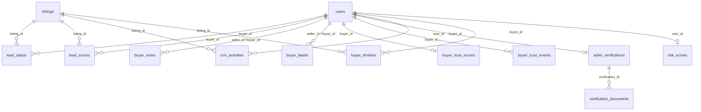

# Data Model: V2 CRM, Trust Engine & Verification Platform

This document describes the database schema additions, table layouts, constraints, and relationships for the V2 CRM, Trust Engine, and Verification Platform.

---

## 1. Entity Schema Definitions

### 1.1 `lead_status`
Tracks the active stage of a buyer's journey regarding a specific listing.

- **Columns**:
  - `id` (INTEGER, PK, Auto-Increment)
  - `listing_id` (INTEGER, FK -> `listings.id`, Nullable=False)
  - `buyer_id` (INTEGER, FK -> `users.id`, Nullable=False)
  - `stage` (VARCHAR, Nullable=False, Default="New")  # "New", "Interested", "Engaged", "Negotiating", "Offer Sent", "Offer Accepted", "Deal Completed", "Lost", "Blocked"
  - `is_archived` (BOOLEAN, Default=False)
  - `created_at` (DATETIME, Default=utcnow)
  - `updated_at` (DATETIME, Default=utcnow)
- **Constraints**:
  - Unique Constraint: `(listing_id, buyer_id)` (One pipeline entry per buyer-listing pair)
- **Indexes**:
  - `idx_lead_status_buyer`: `(buyer_id)`
  - `idx_lead_status_listing`: `(listing_id)`

---

### 1.2 `lead_scores`
Stores the intent scoring metric computed for a buyer on a listing.

- **Columns**:
  - `id` (INTEGER, PK, Auto-Increment)
  - `listing_id` (INTEGER, FK -> `listings.id`, Nullable=False)
  - `buyer_id` (INTEGER, FK -> `users.id`, Nullable=False)
  - `score` (INTEGER, Default=0)  # 0 to 100
  - `category` (VARCHAR, Nullable=False)  # "Cold", "Warm", "Hot", "Priority"
  - `last_recalculated` (DATETIME, Default=utcnow)
- **Constraints**:
  - Unique Constraint: `(listing_id, buyer_id)`
  - Check Constraint: `score >= 0 AND score <= 100`

---

### 1.3 `buyer_notes`
Seller's private notes for a buyer.

- **Columns**:
  - `id` (INTEGER, PK, Auto-Increment)
  - `seller_id` (INTEGER, FK -> `users.id`, Nullable=False)
  - `buyer_id` (INTEGER, FK -> `users.id`, Nullable=False)
  - `content` (TEXT, Nullable=False)
  - `created_at` (DATETIME, Default=utcnow)
- **Indexes**:
  - `idx_buyer_notes_pair`: `(seller_id, buyer_id)`

---

### 1.4 `buyer_labels`
Seller-assigned labels to categorize buyers.

- **Columns**:
  - `id` (INTEGER, PK, Auto-Increment)
  - `seller_id` (INTEGER, FK -> `users.id`, Nullable=False)
  - `buyer_id` (INTEGER, FK -> `users.id`, Nullable=False)
  - `label` (VARCHAR, Nullable=False)  # "VIP", "Repeat Buyer", "Negotiating", "Follow Up", "High Intent", "Suspicious", "Blocked"
  - `created_at` (DATETIME, Default=utcnow)
- **Constraints**:
  - Unique Constraint: `(seller_id, buyer_id, label)`

---

### 1.5 `buyer_trust_scores`
Global trust evaluations for a buyer user.

- **Columns**:
  - `id` (INTEGER, PK, Auto-Increment)
  - `buyer_id` (INTEGER, FK -> `users.id`, Unique=True, Nullable=False)
  - `trust_score` (INTEGER, Default=50)  # 0 to 100
  - `trust_level` (VARCHAR, Default="New Buyer")  # "New Buyer", "Trusted Buyer", "Verified Buyer", "Elite Buyer"
  - `completed_deals` (INTEGER, Default=0)
  - `cancelled_deals` (INTEGER, Default=0)
  - `response_rate` (FLOAT, Default=1.0)
  - `updated_at` (DATETIME, Default=utcnow)
- **Constraints**:
  - Check Constraint: `trust_score >= 0 AND trust_score <= 100`

---

### 1.6 `buyer_trust_events`
Historical log tracking score changes.

- **Columns**:
  - `id` (INTEGER, PK, Auto-Increment)
  - `buyer_id` (INTEGER, FK -> `users.id`, Nullable=False)
  - `previous_score` (INTEGER, Nullable=False)
  - `new_score` (INTEGER, Nullable=False)
  - `event_type` (VARCHAR, Nullable=False)  # "Offer Accepted", "Offer Rejected", "Deal Completed", "Reported", "Blocked", "Spam Violation"
  - `description` (VARCHAR, Nullable=True)
  - `created_at` (DATETIME, Default=utcnow)

---

### 1.7 `seller_verifications`
Verification submissions and status.

- **Columns**:
  - `id` (INTEGER, PK, Auto-Increment)
  - `user_id` (INTEGER, FK -> `users.id`, Unique=True, Nullable=False)
  - `email_verified` (BOOLEAN, Default=False)
  - `phone_verified` (BOOLEAN, Default=False)
  - `id_verified` (BOOLEAN, Default=False)
  - `verification_status` (VARCHAR, Default="Unverified")  # "Unverified", "Pending Review", "Approved", "Rejected"
  - `submitted_at` (DATETIME, Nullable=True)
  - `approved_at` (DATETIME, Nullable=True)
  - `reviewer_notes` (TEXT, Nullable=True)

---

### 1.8 `verification_documents`
References to documents uploaded for review.

- **Columns**:
  - `id` (INTEGER, PK, Auto-Increment)
  - `verification_id` (INTEGER, FK -> `seller_verifications.id`, Nullable=False)
  - `document_type` (VARCHAR, Nullable=False)  # "Passport", "Driving License", "National ID"
  - `file_path` (VARCHAR, Nullable=False)
  - `uploaded_at` (DATETIME, Default=utcnow)

---

### 1.9 `crm_activities`
Aggregated logs of buyer interactions for analytics.

- **Columns**:
  - `id` (INTEGER, PK, Auto-Increment)
  - `listing_id` (INTEGER, FK -> `listings.id`, Nullable=False)
  - `buyer_id` (INTEGER, FK -> `users.id`, Nullable=False)
  - `activity_type` (VARCHAR, Nullable=False)  # "message_sent", "offer_made", "listing_viewed", "wishlist_added"
  - `timestamp` (DATETIME, Default=utcnow)

---

### 1.10 `buyer_timeline`
Sellers' timeline events logging the buyer relationship.

- **Columns**:
  - `id` (INTEGER, PK, Auto-Increment)
  - `listing_id` (INTEGER, FK -> `listings.id`, Nullable=False)
  - `buyer_id` (INTEGER, FK -> `users.id`, Nullable=False)
  - `event_name` (VARCHAR, Nullable=False)  # "Conversation Started", "Offer Sent", "Offer Accepted", "Offer Rejected", "Listing Viewed", "Trust Score Changed"
  - `event_time` (DATETIME, Default=utcnow)
  - `metadata` (TEXT, Nullable=True)  # JSON-formatted string details

---

### 1.11 `risk_scores`
System-generated hazard assessment models.

- **Columns**:
  - `id` (INTEGER, PK, Auto-Increment)
  - `user_id` (INTEGER, FK -> `users.id`, Unique=True, Nullable=False)
  - `risk_score` (INTEGER, Default=0)  # 0 to 100
  - `risk_level` (VARCHAR, Default="Low")  # "Low", "Medium", "High", "Suspicious"
  - `flagged_reasons` (TEXT, Nullable=True)  # JSON list of trigger types
  - `updated_at` (DATETIME, Default=utcnow)

---

## 2. Entity Relationship Diagram (ERD)

