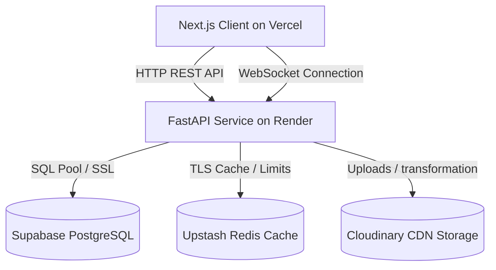
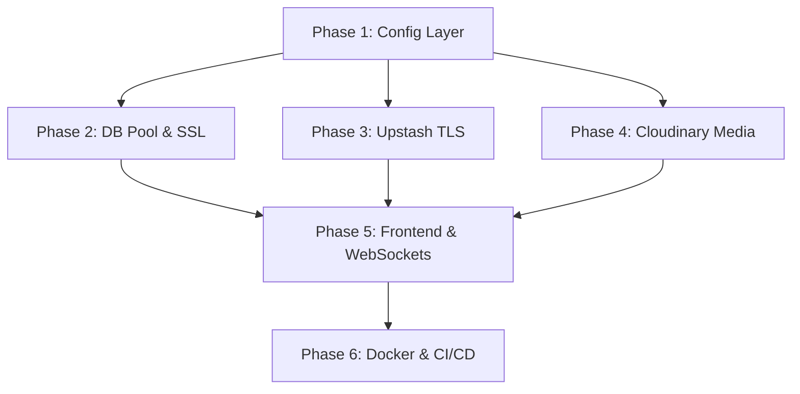

# Implementation Plan: Production Deployment Platform (Local Docker + Render + Vercel)

**Branch**: `007-production-deployment` | **Date**: 2026-06-30 | **Spec**: [/specs/007-production-deployment/spec.md](file:///e:/PPT/jio%20internship/cart/specs/007-production-deployment/spec.md)

**Input**: Feature specification from `/specs/007-production-deployment/spec.md`

---

## 1. Summary

This plan guides the cloud migration and deployment of SmartBazaar V2 to a fully serverless/containerized free cloud stack. It establishes centralized configuration, connection pooling, cache failovers, Cloudinary storage wrappers, auto-reconnecting websockets, optimized Docker, CI/CD, and disaster recovery flows.

---

## 2. Technical Context

**Language/Version**: Python 3.10+ (Backend), TypeScript 5.4+ (Frontend)

**Primary Dependencies**: FastAPI, SQLAlchemy, Pydantic V2, redis-py, cloudinary, next (Next.js)

**Storage**: Supabase PostgreSQL (Production) / SQLite (Local Fallback), Upstash Redis (Production) / InMemoryRedis (Local Fallback), Cloudinary CDN (Production) / `/uploads/` local storage (Local Fallback)

**Testing**: pytest (with pytest-asyncio and HTTPX test client)

**Target Platform**: Vercel (Frontend), Render Web Service (Backend container runtime), Supabase (Database hosting), Upstash (Redis hosting), Cloudinary (Image storage hosting)

**Project Type**: Monolithic repository containing separate frontend (Next.js) and backend (FastAPI) applications

**Performance Goals**: WebSocket reconnection latency under 3 seconds; database connection checks (pre-ping) under 50ms; Cloudinary optimized images loading under 1.5 seconds.

**Constraints**: Must rely strictly on free tiers of Supabase, Upstash, Cloudinary, Vercel, and Render with zero manual configuration steps inside application code files.

---

## 3. Constitution Check

*GATE: Must pass before Phase 0 research. Re-check after Phase 1 design.*

- **P1: Security First (Secrets & CORS)**: All credentials mapped to environment variables and checked dynamically. Wildcard CORS origins rejected; CORS origins fetched dynamically from the configuration.
- **P9: Internship Scope (Zero paid cloud dependencies)**: Operates entirely on local postgres and redis containers or sqlite/in-memory fallbacks when cloud environment variables are absent.
- **P10: Working Software First (Graceful Fallback)**: If Upstash Redis or Cloudinary is unavailable, connection handlers fallback gracefully to InMemoryRedis or local folder writes to maintain chat operations.

---

## 4. Technical Architecture

---

## 5. Implementation Phases

### Phase 1:中央 Configuration & Audit
- **Objective**: 중앙 configuration setup, auditing hardcoded URLs/secrets, and setting up templates.
- **Files Affected**:
  - [config.py](file:///e:/PPT/jio internship/cart/backend/app/config.py)
  - Root: `.env.example`, `.env.development`, `.env.production`
  - Frontend: `frontend/.env.local.example`, `frontend/.env.production.example`
- **Validation**: Verify that running backend with missing envs defaults to local fallbacks.

### Phase 2: Database Migration (Supabase integration)
- **Objective**: Implement postgres SSL, connection pooling, pre-ping checks, and Alembic workflows.
- **Files Affected**:
  - [database.py](file:///e:/PPT/jio internship/cart/backend/app/database.py)
- **Validation**: Verify database queries against a remote Supabase Postgres instance succeed with SSL.

### Phase 3: Cache Migration (Upstash integration)
- **Objective**: Enable TLS connections, timeouts, and `InMemoryRedis` fallback.
- **Files Affected**:
  - [core/redis.py](file:///e:/PPT/jio internship/cart/backend/app/core/redis.py)
- **Validation**: Simulate Redis network loss and verify chat presence managers fall back gracefully without crashes.

### Phase 4: Cloud Media Storage (Cloudinary integration)
- **Objective**: Implement helper functions for uploading, thumbnail transformations, and fallback directories.
- **Files Affected**:
  - [utils/cloudinary.py](file:///e:/PPT/jio internship/cart/backend/app/utils/cloudinary.py) [NEW]
  - [routers/chat.py](file:///e:/PPT/jio internship/cart/backend/app/routers/chat.py)
- **Validation**: Verify uploads write to local storage when Cloudinary keys are absent, and route to Cloudinary when present.

### Phase 5: Client-Side Environment Setup & WebSockets
- **Objective**: Fix hardcoded URLs in components, set up dynamic WS connections, and enable reconnection.
- **Files Affected**:
  - [next.config.js](file:///e:/PPT/jio internship/cart/frontend/next.config.js)
  - [MessageBubble.tsx](file:///e:/PPT/jio internship/cart/frontend/src/components/MessageBubble.tsx)
  - [admin/page.tsx](file:///e:/PPT/jio internship/cart/frontend/src/app/admin/page.tsx)
  - [chatStore.ts](file:///e:/PPT/jio internship/cart/frontend/src/stores/chatStore.ts)
- **Validation**: Verify WebSockets automatically reconnect when the backend container restarts.

### Phase 6: Containers & CI/CD
- **Objective**: Optimize Dockerfile, update Compose settings, and configure GitHub actions.
- **Files Affected**:
  - [backend/Dockerfile](file:///e:/PPT/jio internship/cart/backend/Dockerfile)
  - [docker-compose.yml](file:///e:/PPT/jio internship/cart/docker-compose.yml)
  - [.github/workflows/ci-cd.yml](file:///e:/PPT/jio internship/cart/.github/workflows/ci-cd.yml)
- **Validation**: Push changes and verify that GitHub Actions run tests and build Next.js.

---

## 6. Dependency Graph

---

## 7. Risk Matrix & Mitigation

| Risk | Impact | Likelihood | Mitigation |
| :--- | :--- | :--- | :--- |
| Cloud Database latency slow | High | Medium | Enable connection pooling (`pool_size=10`) and keepalives. |
| Redis Cloud connection timeout hangs backend | Critical | Low | Force 5-second socket timeouts in connection pool setup. |
| Vercel build fails due to missing environment keys | High | Medium | Declare default build args fallback variables. |
| Render server sleep cycle drops WebSocket connections | Medium | High | Clients execute automatic reconnect loops with backoff. |

---

## 8. Rollback Strategy

1. **Database Rollback**: Execute Alembic down migrations locally or restore DB backup via Supabase snapshots.
2. **Backend Rollback**: Revert deployment commit hash on Render to launch the last stable Docker container image.
3. **Frontend Rollback**: Promote the last successful Next.js build using Vercel's Redeploy button.
