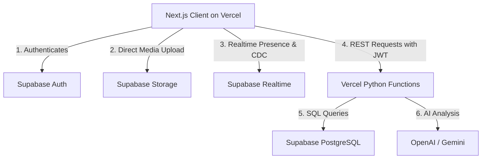
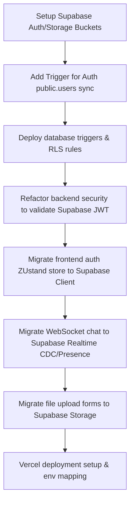

# Implementation Plan: SmartBazaar V3 — Full Serverless Vercel Architecture

**Branch**: `008-serverless-architecture` | **Date**: 2026-07-01 | **Spec**: [spec.md](./spec.md)

**Input**: Feature specification from `/specs/008-serverless-architecture/spec.md`

---

## Summary
Migrate the SmartBazaar monolith from persistent host environments (Render) and stateful services (Redis, WebSockets, persistent workers) to a fully stateless serverless architecture running entirely on **Vercel** and **Supabase**. The frontend Next.js application will deploy on Vercel (App Router), backend FastAPI routes will run as stateless Vercel Python Functions, and all stateful real-time chat, presence, authentication, and file storage operations will be replaced with Supabase platform native features.

---

## Technical Context

* **Language/Version**: Next.js 15 (TypeScript/React 19), FastAPI (Python 3.11).
* **Primary Dependencies**: `@supabase/supabase-js`, `axios`, `jose` (JWT validation), `pydantic-settings`, `@vercel/python`.
* **Storage**: Supabase PostgreSQL (declarative bases via SQLAlchemy ORM).
* **Testing**: `pytest` (backend functions), `playwright` (frontend E2E validation).
* **Target Platform**: Vercel (Serverless Functions and Edge hosting), Supabase Platform (Auth, Database, Realtime, Storage).
* **Project Type**: Full-stack web application.
* **Performance Goals**: API endpoint response latency <250ms (p95), real-time chat delivery <500ms.
* **Constraints**: Stateless functions (execution timeout max 10s), connection pooling limit of 100 concurrent Postgres channels.

---

## Constitution Check
*GATE: Passed. All inputs are validated via strict schemas (Pydantic), raw SQL is prohibited, and local development compatibility remains intact via SQLite and local emulators.*

---

## Project Structure

### Documentation (this feature)
```text
specs/008-serverless-architecture/
├── plan.md              # This file
├── research.md          # Architectural research and decisions
├── data-model.md        # Database schema triggers and RLS policies
├── quickstart.md        # Local development verification guide
└── contracts/
    └── api_contracts.md  # REST API and WS event schemas
```

### Source Code
```text
backend/
├── api/
│   └── main.py          # Stateless Vercel python function entry point
├── app/
│   ├── core/
│   │   ├── config.py    # Supabase-specific environment settings
│   │   └── security.py  # Supabase JWT token verification
│   ├── models/          # Declarative models matching Supabase schema
│   ├── routers/         # Endpoint route handlers (auth, listings, chat, crm)
│   └── services/        # Trust calculations, analytics, and copilot services
└── tests/

frontend/
├── src/
│   ├── app/             # App Router layout pages (Auth, Listings, Chat, CRM)
│   ├── components/      # UI components (TypingIndicator, FileUpload, MessageBubble)
│   ├── lib/
│   │   ├── api.ts       # Axios client injecting Supabase authorization token
│   │   └── supabase.ts  # Client-side Supabase SDK instance
│   └── stores/
│       ├── authStore.ts # Zustand store wrapping Supabase auth states
│       └── chatStore.ts # Zustand store subscribing to Supabase Realtime channels
```

**Structure Decision**: Retain the existing backend/frontend modular monolith folder boundaries, utilizing Vercel function routing mapping (`vercel.json`) to invoke Python handlers seamlessly.

---

## Architecture Diagram (V3 Serverless Flow)



---

## Migration Strategy



---

## Risk Matrix

| Risk | Impact | Likelihood | Mitigation |
| :--- | :--- | :--- | :--- |
| **FastAPI DB Connection Exhaustion** | High | Medium | Use Supabase connection pooling (pgbouncer) port instead of direct Postgres ports. |
| **Vercel Execution Timeout** | High | Low | Move long-running tasks (e.g. background batch analysis) to stateless queues or run on-demand via async execution client returns. |
| **Google Auth Configuration Error** | Medium | Medium | Validate redirect URIs inside Vercel Dashboard and Supabase Console for both local dev and production. |

---

## Rollback Plan

* **Deployment Failure**: Vercel automatically maintains previous deployments. A rollback is triggered instantly via Vercel dashboard by reverting the DNS pointer to the last active stable build.
* **Database / Migration Failure**: If the schema migration triggers database lockups, run the migration rollback:
  ```bash
  alembic downgrade 44f1ebcce96a
  ```
  And restore the database snapshot backup via the Supabase console dashboard.
* **Storage Outage**: If Supabase Storage encounters downtime, the frontend interface falls back to rendering local placeholder assets with warning alerts indicating network degradation.

---

## Timeline & Estimated Effort
- **Total Duration**: 8 Days (Single engineer).
- **Milestones**:
  - *Day 1-2*: Supabase Auth and User Synchronization triggers setup.
  - *Day 3-4*: Real-time Chat and Presence migration to Supabase Realtime.
  - *Day 5-6*: Storage upload integration and RLS security policies execution.
  - *Day 7*: Vercel configuration (`vercel.json`) and stateless Python routing mapping.
  - *Day 8*: E2E Verification testing, error boundary checks, and production release.
