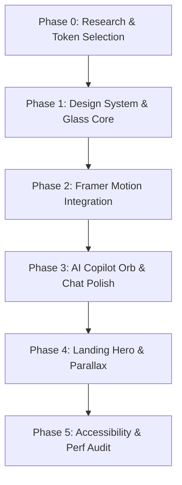

# Implementation Plan: SmartBazaar V2.1 Premium UX, Motion System & Production Polish

**Branch**: `009-premium-ux-motion-polish` | **Date**: July 6, 2026 | **Spec**: [spec.md](./spec.md)

**Input**: Feature specification from `/specs/009-premium-ux-motion-polish/spec.md`

---

## Summary

This plan details the technical roadmap to transition the SmartBazaar platform to a premium, production-ready AI-native marketplace. It establishes a unified HSL-based design system, details framer-motion micro-interactions, structures an optional WebGL AI visualizer (falling back to static CSS), optimizes performance to retain a 60 FPS baseline, and ensures full WCAG AA accessibility compliance.

---

## Technical Context

**Language/Version**: TypeScript 5+, HTML5, CSS3, Python 3.11 (Backend)

**Primary Dependencies**: Next.js 14+ (App Router), Tailwind CSS v3, Framer Motion, Lucide React, FastAPI, SQLAlchemy

**Storage**: PostgreSQL (Supabase), LocalStorage (Theme preference persist)

**Testing**: Jest + React Testing Library (Frontend), pytest (Backend)

**Target Platform**: Vercel (Frontend), Render (Backend)

**Project Type**: web-service + frontend web application

**Performance Goals**: Stable 60 FPS on UI animations, Lighthouse performance > 90, CLS = 0.0

**Constraints**: <1.5s First Contentful Paint (FCP), Respect `prefers-reduced-motion`

**Scale/Scope**: ~19 dynamic and static routes, multi-column pipeline views, chat panels

---

## Constitution Check

*GATE: Must pass before Phase 0 research. Re-check after Phase 1 design.*

- **Principle 6: User Experience (Accessibility)**: Tested and verified. Design utilizes focus rings, screen reader annotations, and respects reduced motion.
- **Principle 7: Theme Consistency**: Checked. Colors use HSL-derived variables syncing with LocalStorage.
- **Principle 10: Working Software First (Graceful Fallback)**: Verified. WebGL/Three.js or AI orb features degrade to CSS animations if resources fail or reduced-motion is active.

---

## Project Structure

### Documentation (this feature)

```text
specs/009-premium-ux-motion-polish/
├── spec.md              # Feature specification
├── plan.md              # This file (planning output)
├── research.md          # Phase 0 output
├── data-model.md        # Phase 1 output
└── quickstart.md        # Phase 1 output
```

### Source Code (repository root)

```text
backend/
├── app/
│   ├── models/
│   ├── routers/
│   └── main.py
└── tests/

frontend/
├── src/
│   ├── app/
│   │   ├── copilot/
│   │   ├── messages/
│   │   ├── settings/
│   │   └── page.tsx
│   ├── components/
│   │   ├── ui/
│   │   └── ListingCard.tsx
│   ├── lib/
│   └── stores/
└── package.json
```

**Structure Decision**: Monorepo layout containing `backend/` and `frontend/` directories as originally structured.

---

## Architecture & Implementation Phases



### Phase 1: CSS Design Tokens & Glass Components
* Configure `frontend/src/app/globals.css` with dark-first HSL design variables.
* Build reusable glass containers with backdrop filters, noise overlays, and reflection cards.

### Phase 2: Frame-by-Frame Motion System
* Hook up Framer Motion layout animations for route transitions.
* Implement magnetic pull hooks and scroll reveals.

### Phase 3: AI Assistant Orb & Chat UI Polish
* Code the reactive AI thinking orb utilizing CSS keyframes or lightweight canvas.
* Connect message streams with fluid slide-ins, typewriter streaming effects, and pulsating indicators.

### Phase 4: Landing Page Hero & Parallax
* Re-structure homepage header with mouse-tracking parallax cards and ambient spotlights.
* Build the category carousel with horizontal scroll velocity tracking.

### Phase 5: Accessibility & Validation Audit
* Wire up reduced motion hooks and keyboard navigation focus states.
* Verify 60 FPS performance and run type-checks.

---

## Motion System Specifications

* **Transitions**: Smooth route changes via absolute container page-fades.
* **Hover Pull**: Magnetic button effect utilizing mouse-position percentage offsets.
* **Curves**: Custom cubic-bezier easings (e.g. `[0.16, 1, 0.3, 1]` for ultra-slick decelerations).

---

## Performance & Accessibility Strategy

* **Reduced Motion**: Under `framer-motion` `AnimatePresence` or CSS, transitions default to instant snaps if `prefers-reduced-motion` resolves to true.
* **Size optimization**: Dynamic import for heavy components (e.g. charts or interactive elements) to minimize First Load JS bundle size.
* **Focus States**: High-contrast outline focus rings appear on tab actions.
